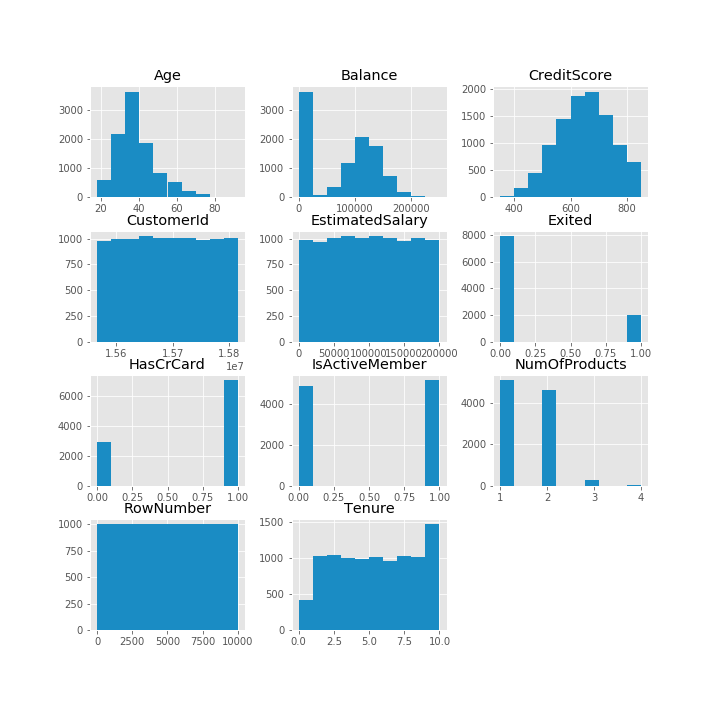
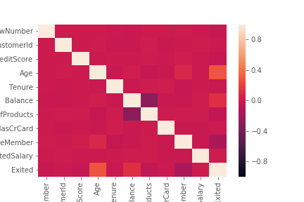
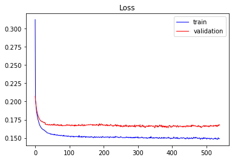
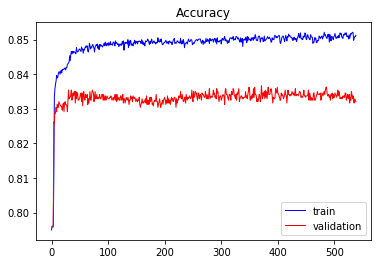
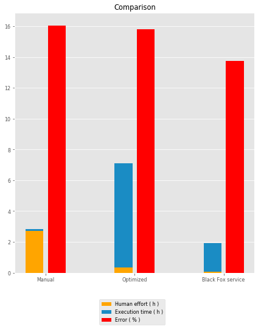

# Churn
  
### Problem explanation:

The customer churn, also known as customer attrition, refers to the phenomenon whereby __a customer leaves a company__. Some studies confirmed that acquiring new customers can cost five times more than satisfying and retaining existing customers. As a matter of fact, there are a lot of benefits that encourage the tracking of the customer churn rate, for example, marketing costs to acquire new customers are high. Therefore, it is important to retain customers so that the initial investment is not wasted, It has a direct impact on the ability to expand the company, etc.

A bank is investigating a very high rate of customer leaving the bank. Here is a 10000 records data set to investigate and predict which of the customers are more likely to leave the bank soon.

This is classification problem and the results are two outputs, customer will leave the bank or he will not. Model inputs are:
 
* Credit score,
* Geography,
* Gender,
* Age,
* Tenure,
* Balance,
* Number of products,
* Has credit card,
* Is active member,
* Estimated salary.

### Problem solution:
The entire data set contains 10000 observations. We divide it into two sets, training set, which contains 8000 observations and test set, which contains 2000 observations. We solved problem in three ways:

* Manually buiilding ANN,
* Tune some hyperparameters by using grid search and
* Employing Black Fox service.

We evaluate the performance of the models using K-fold cross validation. For the purpose of feature scaling, we apply a min max scaler. The independent variables geography and gender are features that are strings so we have to apply label encoder to encode text into numbers and then we can encode geography by one hot encoder. In order to avoid dummy variable trap, for geography we ignored for example feature Germany. To stop the training at the right time, Keras' early stopping scheme is applied.

### Update Keras to latest version


```python
!pip install keras==2.2.4
```

    Requirement already satisfied: keras==2.2.4 in /home/nbuser/anaconda3_501/lib/python3.6/site-packages (2.2.4)
    Requirement already satisfied: scipy>=0.14 in /home/nbuser/anaconda3_501/lib/python3.6/site-packages (from keras==2.2.4) (1.1.0)
    Requirement already satisfied: h5py in /home/nbuser/anaconda3_501/lib/python3.6/site-packages (from keras==2.2.4) (2.8.0)
    Requirement already satisfied: keras-preprocessing>=1.0.5 in /home/nbuser/anaconda3_501/lib/python3.6/site-packages (from keras==2.2.4) (1.0.9)
    Requirement already satisfied: keras-applications>=1.0.6 in /home/nbuser/anaconda3_501/lib/python3.6/site-packages (from keras==2.2.4) (1.0.7)
    Requirement already satisfied: pyyaml in /home/nbuser/anaconda3_501/lib/python3.6/site-packages (from keras==2.2.4) (3.13)
    Requirement already satisfied: six>=1.9.0 in /home/nbuser/anaconda3_501/lib/python3.6/site-packages (from keras==2.2.4) (1.11.0)
    Requirement already satisfied: numpy>=1.9.1 in /home/nbuser/anaconda3_501/lib/python3.6/site-packages (from keras==2.2.4) (1.14.6)
    

# Data preprocessing
#### Importing data frame


```python
# Importing the libraries
import numpy as np
import matplotlib.pyplot as plt
import pandas as pd
import seaborn as sns
import matplotlib as mpl
mpl.style.use('ggplot')

# Importing the date as data frame wich we will import with pandas using the read_csv function.
dataframe = pd.read_csv('Churn_Modelling.csv')
```

#### Dataset info


```python
dataframe.info()
```

    <class 'pandas.core.frame.DataFrame'>
    RangeIndex: 10000 entries, 0 to 9999
    Data columns (total 14 columns):
    RowNumber          10000 non-null int64
    CustomerId         10000 non-null int64
    Surname            10000 non-null object
    CreditScore        10000 non-null int64
    Geography          10000 non-null object
    Gender             10000 non-null object
    Age                10000 non-null int64
    Tenure             10000 non-null int64
    Balance            10000 non-null float64
    NumOfProducts      10000 non-null int64
    HasCrCard          10000 non-null int64
    IsActiveMember     10000 non-null int64
    EstimatedSalary    10000 non-null float64
    Exited             10000 non-null int64
    dtypes: float64(2), int64(9), object(3)
    memory usage: 1.1+ MB
    

#### Dataset description


```python
dataframe.describe()
```


<div>
<style scoped>
    .dataframe tbody tr th:only-of-type {
        vertical-align: middle;
    }

    .dataframe tbody tr th {
        vertical-align: top;
    }

    .dataframe thead th {
        text-align: right;
    }
</style>
<table border="1" class="dataframe">
  <thead>
    <tr style="text-align: right;">
      <th></th>
      <th>RowNumber</th>
      <th>CustomerId</th>
      <th>CreditScore</th>
      <th>Age</th>
      <th>Tenure</th>
      <th>Balance</th>
      <th>NumOfProducts</th>
      <th>HasCrCard</th>
      <th>IsActiveMember</th>
      <th>EstimatedSalary</th>
      <th>Exited</th>
    </tr>
  </thead>
  <tbody>
    <tr>
      <th>count</th>
      <td>10000.00000</td>
      <td>1.000000e+04</td>
      <td>10000.000000</td>
      <td>10000.000000</td>
      <td>10000.000000</td>
      <td>10000.000000</td>
      <td>10000.000000</td>
      <td>10000.00000</td>
      <td>10000.000000</td>
      <td>10000.000000</td>
      <td>10000.000000</td>
    </tr>
    <tr>
      <th>mean</th>
      <td>5000.50000</td>
      <td>1.569094e+07</td>
      <td>650.528800</td>
      <td>38.921800</td>
      <td>5.012800</td>
      <td>76485.889288</td>
      <td>1.530200</td>
      <td>0.70550</td>
      <td>0.515100</td>
      <td>100090.239881</td>
      <td>0.203700</td>
    </tr>
    <tr>
      <th>std</th>
      <td>2886.89568</td>
      <td>7.193619e+04</td>
      <td>96.653299</td>
      <td>10.487806</td>
      <td>2.892174</td>
      <td>62397.405202</td>
      <td>0.581654</td>
      <td>0.45584</td>
      <td>0.499797</td>
      <td>57510.492818</td>
      <td>0.402769</td>
    </tr>
    <tr>
      <th>min</th>
      <td>1.00000</td>
      <td>1.556570e+07</td>
      <td>350.000000</td>
      <td>18.000000</td>
      <td>0.000000</td>
      <td>0.000000</td>
      <td>1.000000</td>
      <td>0.00000</td>
      <td>0.000000</td>
      <td>11.580000</td>
      <td>0.000000</td>
    </tr>
    <tr>
      <th>25%</th>
      <td>2500.75000</td>
      <td>1.562853e+07</td>
      <td>584.000000</td>
      <td>32.000000</td>
      <td>3.000000</td>
      <td>0.000000</td>
      <td>1.000000</td>
      <td>0.00000</td>
      <td>0.000000</td>
      <td>51002.110000</td>
      <td>0.000000</td>
    </tr>
    <tr>
      <th>50%</th>
      <td>5000.50000</td>
      <td>1.569074e+07</td>
      <td>652.000000</td>
      <td>37.000000</td>
      <td>5.000000</td>
      <td>97198.540000</td>
      <td>1.000000</td>
      <td>1.00000</td>
      <td>1.000000</td>
      <td>100193.915000</td>
      <td>0.000000</td>
    </tr>
    <tr>
      <th>75%</th>
      <td>7500.25000</td>
      <td>1.575323e+07</td>
      <td>718.000000</td>
      <td>44.000000</td>
      <td>7.000000</td>
      <td>127644.240000</td>
      <td>2.000000</td>
      <td>1.00000</td>
      <td>1.000000</td>
      <td>149388.247500</td>
      <td>0.000000</td>
    </tr>
    <tr>
      <th>max</th>
      <td>10000.00000</td>
      <td>1.581569e+07</td>
      <td>850.000000</td>
      <td>92.000000</td>
      <td>10.000000</td>
      <td>250898.090000</td>
      <td>4.000000</td>
      <td>1.00000</td>
      <td>1.000000</td>
      <td>199992.480000</td>
      <td>1.000000</td>
    </tr>
  </tbody>
</table>
</div>


#### Histograms of the numerical features


```python
dataframe.hist(figsize=(10,10));
```





#### Corelation heatmap


```python
sns.heatmap(dataframe.corr(), vmin=-1, vmax=1);
```





####  Separate the data frame into feature matrix X and dependent variable y


```python
X = dataframe.iloc[:, 3:13].values
y = dataframe.iloc[:, 13:14].values
```

#### Encode the categorical variables in our feature matrix


```python
from sklearn.preprocessing import LabelEncoder, OneHotEncoder
labelencoder_X_1 = LabelEncoder()

# Encoding geography( countries )
X[:, 1] = labelencoder_X_1.fit_transform(X[:, 1])
labelencoder_X_2 = LabelEncoder()

# Encoding gender
X[:, 2] = labelencoder_X_2.fit_transform(X[:, 2])

# OneHotEncoding the countries to make dummy variables for this categorical variable.
onehotencoder = OneHotEncoder(categorical_features = [1])
X = onehotencoder.fit_transform(X).toarray()

# OneHotEncoding the outputs to make dummy variables for this categorical variable.
onehotencoder_for_output = OneHotEncoder(categorical_features = [0])
y = onehotencoder_for_output.fit_transform(y).toarray()
y = np.where(y == y.min(axis=1).reshape(len(y),1), 1, 0)

# To avoid dummy variable trap we remove for example countre Germany.
X = X[:, 1:]
```

#### Split the entire data set into the training set and test set


```python
from sklearn.model_selection import train_test_split
X_train, X_test, y_train, y_test = train_test_split(X, y, test_size = 0.2, random_state = 0)
```

#### Apply the feature scaling because we don't wanna have any feature dominating another feature


```python
# Standard Scaler
from sklearn.preprocessing import StandardScaler
ss = StandardScaler()
X_train_StandardScaler = ss.fit_transform(X_train)
X_test_StandardScaler = ss.transform(X_test)
```

# Option 1 - manually build ANN using Keras


```python
# Importing the keras libraries and packages
import keras
from keras.models import Sequential
from keras.layers import Dense
from keras.callbacks import Callback, TensorBoard, ModelCheckpoint
from keras.callbacks import EarlyStopping

import time
start1 = time.time()

classifier = Sequential()
classifier.add(Dense(units = 6, kernel_initializer = 'uniform', activation = 'relu', input_dim = 11))
classifier.add(Dense(units = 6, kernel_initializer = 'uniform', activation = 'relu'))
classifier.add(Dense(units = 2, kernel_initializer = 'uniform', activation = 'sigmoid'))
es = EarlyStopping(monitor = 'val_loss',
                   mode = 'auto',
                   #min_delta = 0,
                   patience = 150,
                   verbose = 1,
                   #baseline=0.4,
                   restore_best_weights = True
                  )
classifier.compile(optimizer = 'adam', loss = 'mean_absolute_error', metrics = ['accuracy'])
classifier.fit(x = X_train_StandardScaler, y = y_train, validation_split = 0.3, batch_size = 10, epochs = 3000, callbacks = [es], verbose=1)

end1 = time.time()

time1 = int(end1-start1)
minutes1, seconds1= divmod(time1, 60)
hours1, minutes1= divmod(minutes1, 60)
```

    Using TensorFlow backend.
    

    Train on 5600 samples, validate on 2400 samples
    Epoch 1/3000
    5600/5600 [==============================] - 1s 245us/step - loss: 0.3124 - acc: 0.7950 - val_loss: 0.2074 - val_acc: 0.7958
    Epoch 2/3000
    5600/5600 [==============================] - 1s 192us/step - loss: 0.2017 - acc: 0.7961 - val_loss: 0.2015 - val_acc: 0.7958
    Epoch 3/3000
    5600/5600 [==============================] - 1s 223us/step - loss: 0.1974 - acc: 0.7961 - val_loss: 0.1979 - val_acc: 0.7958
    .
    .
    .
    Epoch 537/3000
    5600/5600 [==============================] - 1s 181us/step - loss: 0.1490 - acc: 0.8509 - val_loss: 0.1667 - val_acc: 0.8329
    Epoch 538/3000
    5600/5600 [==============================] - 1s 187us/step - loss: 0.1490 - acc: 0.8509 - val_loss: 0.1675 - val_acc: 0.8325
    Epoch 539/3000
    5600/5600 [==============================] - 1s 182us/step - loss: 0.1491 - acc: 0.8512 - val_loss: 0.1684 - val_acc: 0.8321
    Restoring model weights from the end of the best epoch
    Epoch 00539: early stopping
    

#### Plot loss during training


```python
plt.title('Loss')
plt.plot(classifier.history.history['loss'], label = 'train', color = 'blue', linewidth = 1)
plt.plot(classifier.history.history['val_loss'], label = 'validation', color = 'red', linewidth = 1)
plt.legend()
plt.show()
```





#### Plot accuracy during training


```python
plt.title('Accuracy')
plt.plot(classifier.history.history['acc'], label='train', color = 'blue', linewidth = 1)
plt.plot(classifier.history.history['val_acc'], label='validation', color = 'red', linewidth = 1)
plt.legend()
plt.show()
```





#### We just trained our artificial neural network on the training set and now it's time to make the prediction on the test set


```python
y_pred_trained = classifier.predict(X_test_StandardScaler)

y_pred_for_confusionMatrix = (y_pred_trained[:,0] > y_pred_trained[:,1]).reshape(y_pred_trained.shape[0],1)
y_pred_for_confusionMatrix = np.where(y_pred_for_confusionMatrix == True, 1, 0)
y_test_for_confusionMatrix = (y_test[:,0] > y_test[:,1]).reshape(y_test.shape[0],1)
y_test_for_confusionMatrix = np.where(y_test_for_confusionMatrix == True, 1, 0)

from sklearn.metrics import confusion_matrix
cm = confusion_matrix(y_test_for_confusionMatrix, y_pred_for_confusionMatrix)

errorOnTestSetTrained = 100*(cm[0,1]+cm[1,0])/y_test.shape[0]

print("\nTime to manually train one network is ", time1,"seconds(",hours1,"hours,",minutes1,"minutes and ",seconds1,"seconds ).")
print("\nWe got confusion matrix:\n",cm)
print("\nTest set error on manually train one network, which we can read in confusion matrix is",errorOnTestSetTrained,"%.")
```

    
    Time to manually train one network is  596 seconds( 0 hours, 9 minutes and  56 seconds ).
    
    We got confusion matrix:
     [[1552   43]
     [ 278  127]]
    
    Test set error on manually train one network, which we can read in confusion matrix is 16.05 %.
    

# Option 2 - Parameter tuning by Grid search
We have two type of model parameters, __the weights__ obtained during training process, and parameters that stay fixed, called the __hyperparameters__. The examples of th hyperparameters are __number of epochs__, __batch size__, __type of optimizer__, __number of layers__, __the number of neurons layers__ etc. The ANN trained in __Option 1__ used fixed values of these hyperparameters, but perhaps some other values would lead us to a better accuracy.

The parameter tuning is all about finding the best values of the hyperparameters. We will try this using a simple technique called __Grid search__ that will test several combinations of hyperparameter and return the best choice that leads to the best accuracy obtained by K-fold cross validation.


```python
from keras.wrappers.scikit_learn import KerasClassifier
from sklearn.model_selection import GridSearchCV
from keras.models import Sequential
from keras.layers import Dense

import time
start2 = time.time()

def build_classifier(optimizer):
   classifier = Sequential()
   classifier.add(Dense(units = 6, kernel_initializer = 'uniform', activation = 'relu', input_dim = 11))
   classifier.add(Dense(units = 6, kernel_initializer = 'uniform', activation = 'relu'))
   classifier.add(Dense(units = 2, kernel_initializer = 'uniform', activation = 'sigmoid'))
   classifier.compile(optimizer = optimizer, loss = 'mean_absolute_error', metrics = ['accuracy'])
   return classifier

Tuning_classifier = KerasClassifier(build_fn = build_classifier)
parameters = {'batch_size': [32, 50], 
              'epochs': [3000],
              'optimizer': ['adam', 'rmsprop']
             }

grid_search = GridSearchCV(estimator = Tuning_classifier,
                           param_grid = parameters,
                           #scoring = 'accuracy',
                           cv = 10,
                          )

grid_search = grid_search.fit(X_train_StandardScaler, y_train)

best_parameters = grid_search.best_params_
best_accuracy = grid_search.best_score_

print("Best parameters are :\n", best_parameters)
print("\nBest accuracy is :\n", best_accuracy)


end2 = time.time()
```

    Using TensorFlow backend.
    

    Epoch 1/3000
    5333/5333 [==============================] - 2s 290us/step - loss: 0.4539 - acc: 0.7967
    Epoch 2/3000
    5333/5333 [==============================] - 0s 48us/step - loss: 0.2648 - acc: 0.7980
    Epoch 3/3000
    5333/5333 [==============================] - 0s 54us/step - loss: 0.2123 - acc: 0.7980
    .
    .
    .
    Epoch 2998/3000
    8000/8000 [==============================] - 1s 70us/step - loss: 0.1488 - acc: 0.8511
    Epoch 2999/3000
    8000/8000 [==============================] - 1s 75us/step - loss: 0.1480 - acc: 0.8520
    Epoch 3000/3000
    8000/8000 [==============================] - 1s 67us/step - loss: 0.1479 - acc: 0.8521
    Best parameters are :
     {'batch_size': 32, 'epochs': 3000, 'optimizer': 'adam'}
    
    Best accuracy is :
     0.8390000000298024
    

#### Our optimized ANN resides in grid_search. Now it's time to make the prediction on the test set


```python
time2 = int(end2-start2)
minutes2, seconds2= divmod(time2, 60)
hours2, minutes2= divmod(minutes2, 60)

y_pred_tuning = grid_search.predict_proba(X_test_StandardScaler)
#print("Predicted values are:\n\n", y_pred_tuning[:10,:])

y_pred_tuning_for_confusionMatrix = (y_pred_tuning[:,0] > y_pred_tuning[:,1]).reshape(y_pred_tuning.shape[0],1)
y_pred_tuning_for_confusionMatrix = np.where(y_pred_tuning_for_confusionMatrix == True, 1, 0)
y_test_for_confusionMatrix = (y_test[:,0] > y_test[:,1]).reshape(y_test.shape[0],1)
y_test_for_confusionMatrix = np.where(y_test_for_confusionMatrix == True, 1, 0)

from sklearn.metrics import confusion_matrix
cm = confusion_matrix(y_test_for_confusionMatrix, y_pred_tuning_for_confusionMatrix)

errorOnTestSetTuning = 100*(cm[0,1]+cm[1,0])/y_test.shape[0]

print("\nTime needed for tuning is ", time2,"seconds(",hours2,"hours,",minutes2,"minutes and ",seconds2,"seconds).")
print("\nWe got confusion matrix:\n",cm)
print("\nTest set error with tuning, which we can read in confusion matrix is",errorOnTestSetTuning,"%.")
```

    
    Time needed for tuning is  24270 seconds( 6 hours, 44 minutes and  30 seconds).
    
    We got confusion matrix:
     [[1540   55]
     [ 261  144]]
    
    Test set error with tuning, which we can read in confusion matrix is 15.8 %.
    

# Option 3 - Optimize ANN using Black Fox service

#### Install Black fox service


```python
!pip install git+https://github.com/tmrdja/BlackFoxPython.git
```

    Collecting git+https://github.com/tmrdja/BlackFoxPython.git
      Cloning https://github.com/tmrdja/BlackFoxPython.git to /tmp/pip-req-build-7wntzcq6
    Requirement already satisfied: urllib3>=1.15 in /home/nbuser/anaconda3_501/lib/python3.6/site-packages (from blackfox==0.0.2) (1.23)
    Requirement already satisfied: six>=1.10 in /home/nbuser/anaconda3_501/lib/python3.6/site-packages (from blackfox==0.0.2) (1.11.0)
    Requirement already satisfied: certifi in /home/nbuser/anaconda3_501/lib/python3.6/site-packages (from blackfox==0.0.2) (2018.10.15)
    Requirement already satisfied: python-dateutil in /home/nbuser/anaconda3_501/lib/python3.6/site-packages (from blackfox==0.0.2) (2.7.5)
    Building wheels for collected packages: blackfox
      Building wheel for blackfox (setup.py) ... [?25ldone
    [?25h  Stored in directory: /tmp/pip-ephem-wheel-cache-ntp9dne_/wheels/46/d5/ca/47789f92af70d12cb6fc5f0c752e911491b82477816f26da21
    Successfully built blackfox
    Installing collected packages: blackfox
    Successfully installed blackfox-0.0.2
    

#### Let's run the Black Fox service to find best ANN for the specific problem. Note that we optimize the architecture, as well!


```python
# Importing the BF service libraries and other libraries
from blackfox import BlackFox
from blackfox import KerasOptimizationConfig
from blackfox import OptimizationEngineConfig
import h5py
#from keras.models import load_model
#import numpy as np
#import pandas as pd

blackfox_url = 'http://147.91.204.14:32701'
bf = BlackFox(blackfox_url)

ec = OptimizationEngineConfig(proc_timeout_miliseconds=2000000, population_size=50, max_num_of_generations=20)
c = KerasOptimizationConfig(engine_config=ec, max_epoch =500, validation_split=0.3)

import time
start3 = time.time()

# Use CTRL + C to stop optimization
(ann_io, ann_info, ann_metadata) = bf.optimize_keras_sync(
    input_set = X_train,
    output_set = y_train,
    config = c,
    integrate_scaler=False,
    network_path='OptimizedANNChurn_final_adadelta.h5'
)

end3 = time.time()
time3 = int(end3-start3)

print('\nann info:')
print(ann_info)

print('\nann metadata:')
print(ann_metadata)
```

    Use CTRL + C to stop optimization
    Uploading data set
    Starting...
    2019-04-17 12:59:21.537203 -> Active, Generation: 0/20, Validation set error: 0.000000, Training set error: 0.000000, Epoch: 0, Optimization Id: 66ae7e4b-9259-4674-a87d-6923399758a7
    2019-04-17 13:07:29.618954 -> Active, Generation: 1/20, Validation set error: 0.176771, Training set error: 0.173840, Epoch: 311, Optimization Id: 66ae7e4b-9259-4674-a87d-6923399758a7
    .
    .
    .
    2019-04-17 14:03:35.734175 -> Active, Generation: 19/20, Validation set error: 0.145997, Training set error: 0.134294, Epoch: 160, Optimization Id: 66ae7e4b-9259-4674-a87d-6923399758a7
    2019-04-17 14:03:41.016981 -> Active, Generation: 19/20, Validation set error: 0.145997, Training set error: 0.134294, Epoch: 160, Optimization Id: 66ae7e4b-9259-4674-a87d-6923399758a7
    2019-04-17 14:03:46.506392 -> Finished, Generation: 20/20, Validation set error: 0.146461, Training set error: 0.134998, Epoch: 215, Optimization Id: 66ae7e4b-9259-4674-a87d-6923399758a7
    stopped Finished
    Downloading network 9aa29e6ab62f900d988e7beaca109ef52c985fb4
    Saving network 9aa29e6ab62f900d988e7beaca109ef52c985fb4 to OptimizedANNChurn_final_adadelta.h5
    
    ann info:
    {'dropout': 0.04,
     'hidden_layers': [{'activation_function': 'ReLu', 'neuron_count': 9},
                       {'activation_function': 'ReLu', 'neuron_count': 9}],
     'id': '9aa29e6ab62f900d988e7beaca109ef52c985fb4',
     'output_layer_activation_function': 'ReLu',
     'training_algorithm': 'Nadam'}
    
    ann metadata:
    {'__version': 1, 'is_scaler_integrated': False, 'scaler_config': {'input': {'feature_range': [0, 1], 'fit': [[0.0, 0.0, 350.0, 0.0, 18.0, 0.0, 0.0, 1.0, 0.0, 0.0, 11.58], [1.0, 1.0, 850.0, 1.0, 88.0, 10.0, 238387.56, 4.0, 1.0, 1.0, 199992.48]], 'inverse_transform': False}, 'output': {'feature_range': [0, 1], 'fit': [[0.0, 0.0], [1.0, 1.0]], 'inverse_transform': True}}, 'scaler_name': 'MinMaxScaler'}
    

#### The data set passed to the Black Fox service was not scaled since Black Fox scales inputs automatically. In order to apply obtained ANN in prediction, BlackFox offers the utility function to scale our test set the same way.


```python
# Get metadata
meta = bf.get_metadata('OptimizedANNChurn_final_adadelta.h5')
scaler_config = meta['scaler_config']

# Scale
x_scaler_config = scaler_config['input']
from sklearn.preprocessing import MinMaxScaler 
min_max_x = MinMaxScaler(feature_range=x_scaler_config['feature_range'])
min_max_x.fit(x_scaler_config['fit'])

X_test_minMaxScaled_withBF = min_max_x.transform(X_test)
#print(X_test_minMaxScaled_withBF[:10,:])
```

#### Prediction using ANN proposed by Black Fox


```python
# Importing ANN model
from keras.models import load_model
model = load_model('OptimizedANNChurn_final_adadelta.h5')

# Predicted values
y_pred_BF=model.predict(X_test_minMaxScaled_withBF)
#print("Predicted values are:\n\n", y_pred_BF[:20,:])
```

#### Rescale


```python
# Rescale
y_scaler_config = scaler_config['output']
min_max_y = MinMaxScaler(feature_range=y_scaler_config['feature_range'])
min_max_y.fit(y_scaler_config['fit'])

y_pred_BF_realValues = min_max_y.inverse_transform(y_pred_BF)
#print("\nFirst 6 real predicted values are:\n", y_pred_BF_realValues[:6,:])

#y_pred_BF_realValues = mms_y.inverse_transform(y_pred_BF)
#print("\nFirst 6 real predicted values are:\n", y_pred_BF_realValues[:6,:])
```

#### Compute error


```python
y_pred_BF_for_confusionMatrix = (y_pred_BF_realValues[:,0] > y_pred_BF_realValues[:,1]).reshape(y_pred_BF_realValues.shape[0],1)
y_pred_BF_for_confusionMatrix = np.where(y_pred_BF_for_confusionMatrix == True, 1, 0)
y_test_for_confusionMatrix = (y_test[:,0] > y_test[:,1]).reshape(y_test.shape[0],1)
y_test_for_confusionMatrix = np.where(y_test_for_confusionMatrix == True, 1, 0)

from sklearn.metrics import confusion_matrix
cm = confusion_matrix(y_test_for_confusionMatrix, y_pred_BF_for_confusionMatrix)

errorOnTestSetBF = 100*(cm[0,1]+cm[1,0])/y_test.shape[0]

minutes3, seconds3= divmod(time3, 60)
hours3, minutes3= divmod(minutes3, 60)

print("\nTime for finding the best ANN by Black Fox service is ", time3,"seconds(",hours3,"hours,",minutes3,"minutes and ",seconds3,"seconds).")
print("\nWe got confusion matrix:\n",cm)
print("\nTest set error for finding the best ANN by Black Fox service, which we can read in confusion matrix is",errorOnTestSetBF,"%.")
```

    
    Time for finding the best ANN by Black Fox service is  3874 seconds( 1 hours, 4 minutes and  34 seconds).
    
    We got confusion matrix:
     [[1550   45]
     [ 233  172]]
    
    Test set error for finding the best ANN by Black Fox service, which we can read in confusion matrix is 13.9 %.
    

# RESULTS AND DISCUSSION


```python
plt.style.use('ggplot')
mpl.rc('lines', linewidth=1)
mpl.rc('font', size='8')

n_groups = 3
group_1 = (Human_time1/3600, Human_time2/3600, Human_time3/3600)
group_2 = (time1/3600, time2/3600, time3/3600)
group_3 = (errorOnTestSetTrained, errorOnTestSetTuning, errorOnTestSetBF)

# create plot
fig, ax = plt.subplots(figsize=(6,7.5))
ax.xaxis.grid(False)
index = np.arange(n_groups)
bar_width = 0.2
space = 0.05
opacity = 1


rects1 = plt.bar(index, group_1, bar_width, color = 'orange',
alpha=opacity,
label='Human effort ( h )')

rects2 = plt.bar(index, group_2, bar_width, bottom =group_1, color = (0.1, 0.55, 0.77),
alpha=opacity,
label='Execution time ( h )')

rects3 = plt.bar(index + bar_width+space, group_3, bar_width, color = 'red',
alpha=opacity,
label='Error ( % )')


plt.title('Comparison')
plt.xticks(index + (bar_width/2 + space/2), ('Manual', 'Optimized', 'Black Fox service'))
plt.legend(loc = (0.353,-0.2))
 
plt.tight_layout()
#plt.savefig("ChurnModeling.svg")
plt.show()
```





#### Although we measured this three options, actually they are not so comparable, because in Python we had a man sitting in office and programming those neural networks (options 1 and 2) while in Black Fox service (option 3), he imported the same data set and the service did the rest, while he went to rest or dring coffe, for example, so actually, in Black Fox service he wrote few lines of code and thats all of hard work. Results in the given plots above speak for themself. As you can see, Black Fox service gave better results in less time and effort to create approximate results in Python as Black Fox did is immeasurably large.
