# Churn
  
### Problem explanation:

The customer churn, also known as customer attrition, refers to the phenomenon whereby __a customer leaves a company__. Some studies confirmed that acquiring new customers can cost five times more than satisfying and retaining existing customers. As a matter of fact, there are a lot of benefits that encourage the tracking of the customer churn rate, for example, marketing costs to acquire new customers are high. Therefore, it is important to retain customers so that the initial investment is not wasted, It has a direct impact on the ability to expand the company, etc.

A bank is investigating a very high rate of customer leaving the bank. Here is a 10000 records data set to investigate and predict which of the customers are more likely to leave the bank soon.

This is classification problem and the results are two outputs, customer will leave the bank or he will not. Model inputs are:
 
* Credit score,
* Geography,
* Gender,
* Age,
* Tenure,
* Balance,
* Number of products,
* Has credit card,
* Is active member,
* Estimated salary.

### Problem solution:
The entire data set contains 10000 observations. We randomly picked 5000 observations and we divide it into two sets, training set, which contains 4000 observations and test set, which contains 1000 observations. We solved problem in three ways:

* Manually buiilding ANN,
* Tune some hyperparameters by using grid search and
* Employing Black Fox service.

We evaluate the performance of the models using K-fold cross validation. For the purpose of feature scaling, we apply a min max scaler. The independent variables geography and gender are features that are strings so we have to apply label encoder to encode text into numbers and then we can encode geography by one hot encoder. In order to avoid dummy variable trap, for geography we ignored for example feature Germany. To stop the training at the right time, Keras' early stopping scheme is applied.

### Update Keras to latest version


```python
!pip install keras==2.2.4
```

    Collecting keras==2.2.4
    [?25l  Downloading https://files.pythonhosted.org/packages/5e/10/aa32dad071ce52b5502266b5c659451cfd6ffcbf14e6c8c4f16c0ff5aaab/Keras-2.2.4-py2.py3-none-any.whl (312kB)
        100% |████████████████████████████████| 317kB 13.9MB/s ta 0:00:01
    [?25hRequirement already satisfied: keras-preprocessing>=1.0.5 in /home/nbuser/anaconda3_501/lib/python3.6/site-packages (from keras==2.2.4) (1.0.9)
    Requirement already satisfied: scipy>=0.14 in /home/nbuser/anaconda3_501/lib/python3.6/site-packages (from keras==2.2.4) (1.1.0)
    Requirement already satisfied: h5py in /home/nbuser/anaconda3_501/lib/python3.6/site-packages (from keras==2.2.4) (2.8.0)
    Requirement already satisfied: six>=1.9.0 in /home/nbuser/anaconda3_501/lib/python3.6/site-packages (from keras==2.2.4) (1.11.0)
    Requirement already satisfied: pyyaml in /home/nbuser/anaconda3_501/lib/python3.6/site-packages (from keras==2.2.4) (3.13)
    Requirement already satisfied: keras-applications>=1.0.6 in /home/nbuser/anaconda3_501/lib/python3.6/site-packages (from keras==2.2.4) (1.0.7)
    Requirement already satisfied: numpy>=1.9.1 in /home/nbuser/anaconda3_501/lib/python3.6/site-packages (from keras==2.2.4) (1.14.6)
    Installing collected packages: keras
      Found existing installation: Keras 2.2.2
        Uninstalling Keras-2.2.2:
          Successfully uninstalled Keras-2.2.2
    Successfully installed keras-2.2.4
    You are using pip version 19.0.3, however version 19.1 is available.
    You should consider upgrading via the 'pip install --upgrade pip' command.
    

# Data preprocessing
#### Importing data frame


```python
# Importing the libraries
import numpy as np
import matplotlib.pyplot as plt
import matplotlib as mpl
import pandas as pd
import seaborn as sns
import matplotlib

mpl.style.use('ggplot')
plt.style.use('ggplot')
matplotlib.style.use('ggplot')

dataframe = pd.read_csv('Churn_5k.csv')
```

#### Dataset info


```python
dataframe.info()
```

    <class 'pandas.core.frame.DataFrame'>
    RangeIndex: 5000 entries, 0 to 4999
    Data columns (total 14 columns):
    RowNumber          5000 non-null int64
    CustomerId         5000 non-null int64
    Surname            5000 non-null object
    CreditScore        5000 non-null int64
    Geography          5000 non-null object
    Gender             5000 non-null object
    Age                5000 non-null int64
    Tenure             5000 non-null int64
    Balance            5000 non-null float64
    NumOfProducts      5000 non-null int64
    HasCrCard          5000 non-null int64
    IsActiveMember     5000 non-null int64
    EstimatedSalary    5000 non-null float64
    Exited             5000 non-null int64
    dtypes: float64(2), int64(9), object(3)
    memory usage: 547.0+ KB
    

#### Dataset description


```python
dataframe.describe()
```


<div>
<style scoped>
    .dataframe tbody tr th:only-of-type {
        vertical-align: middle;
    }

    .dataframe tbody tr th {
        vertical-align: top;
    }

    .dataframe thead th {
        text-align: right;
    }
</style>
<table border="1" class="dataframe">
  <thead>
    <tr style="text-align: right;">
      <th></th>
      <th>RowNumber</th>
      <th>CustomerId</th>
      <th>CreditScore</th>
      <th>Age</th>
      <th>Tenure</th>
      <th>Balance</th>
      <th>NumOfProducts</th>
      <th>HasCrCard</th>
      <th>IsActiveMember</th>
      <th>EstimatedSalary</th>
      <th>Exited</th>
    </tr>
  </thead>
  <tbody>
    <tr>
      <th>count</th>
      <td>5000.000000</td>
      <td>5.000000e+03</td>
      <td>5000.000000</td>
      <td>5000.000000</td>
      <td>5000.000000</td>
      <td>5000.000000</td>
      <td>5000.000000</td>
      <td>5000.000000</td>
      <td>5000.000000</td>
      <td>5000.000000</td>
      <td>5000.000000</td>
    </tr>
    <tr>
      <th>mean</th>
      <td>5037.136200</td>
      <td>1.569135e+07</td>
      <td>651.229200</td>
      <td>38.859400</td>
      <td>4.973800</td>
      <td>76635.872688</td>
      <td>1.529200</td>
      <td>0.709200</td>
      <td>0.518400</td>
      <td>100401.897116</td>
      <td>0.202000</td>
    </tr>
    <tr>
      <th>std</th>
      <td>2870.860248</td>
      <td>7.216109e+04</td>
      <td>96.177839</td>
      <td>10.513636</td>
      <td>2.894407</td>
      <td>62534.011985</td>
      <td>0.572724</td>
      <td>0.454177</td>
      <td>0.499711</td>
      <td>57887.016029</td>
      <td>0.401532</td>
    </tr>
    <tr>
      <th>min</th>
      <td>5.000000</td>
      <td>1.556571e+07</td>
      <td>350.000000</td>
      <td>18.000000</td>
      <td>0.000000</td>
      <td>0.000000</td>
      <td>1.000000</td>
      <td>0.000000</td>
      <td>0.000000</td>
      <td>90.070000</td>
      <td>0.000000</td>
    </tr>
    <tr>
      <th>25%</th>
      <td>2590.750000</td>
      <td>1.562831e+07</td>
      <td>584.000000</td>
      <td>32.000000</td>
      <td>2.000000</td>
      <td>0.000000</td>
      <td>1.000000</td>
      <td>0.000000</td>
      <td>0.000000</td>
      <td>50781.767500</td>
      <td>0.000000</td>
    </tr>
    <tr>
      <th>50%</th>
      <td>5027.000000</td>
      <td>1.569014e+07</td>
      <td>653.000000</td>
      <td>37.000000</td>
      <td>5.000000</td>
      <td>97145.940000</td>
      <td>1.000000</td>
      <td>1.000000</td>
      <td>1.000000</td>
      <td>100399.670000</td>
      <td>0.000000</td>
    </tr>
    <tr>
      <th>75%</th>
      <td>7527.500000</td>
      <td>1.575503e+07</td>
      <td>718.000000</td>
      <td>44.000000</td>
      <td>7.000000</td>
      <td>127846.872500</td>
      <td>2.000000</td>
      <td>1.000000</td>
      <td>1.000000</td>
      <td>150581.287500</td>
      <td>0.000000</td>
    </tr>
    <tr>
      <th>max</th>
      <td>9999.000000</td>
      <td>1.581566e+07</td>
      <td>850.000000</td>
      <td>92.000000</td>
      <td>10.000000</td>
      <td>222267.630000</td>
      <td>4.000000</td>
      <td>1.000000</td>
      <td>1.000000</td>
      <td>199970.740000</td>
      <td>1.000000</td>
    </tr>
  </tbody>
</table>
</div>


#### Histograms of the numerical features


```python
dataframe.hist(figsize=(10,10));
```


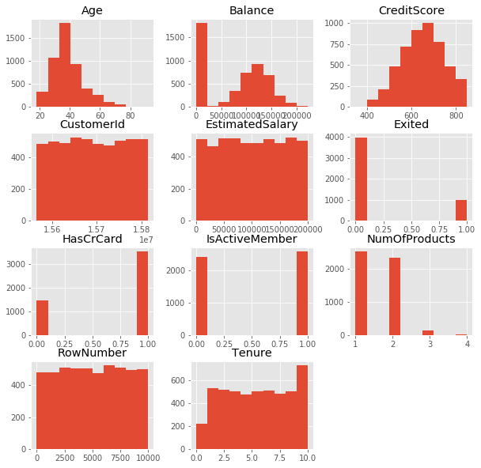


#### Corelation heatmap


```python
sns.heatmap(dataframe.corr(), vmin=-1, vmax=1);
```


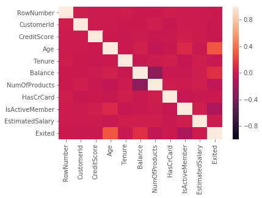


####  Separate the data frame into feature matrix X and dependent variable y


```python
X = dataframe.iloc[:, 3:13].values
y = dataframe.iloc[:, 13:14].values
```

#### Encode the categorical variables in our feature matrix


```python
from sklearn.preprocessing import LabelEncoder, OneHotEncoder
labelencoder_X_1 = LabelEncoder()

# Encoding geography( countries )
X[:, 1] = labelencoder_X_1.fit_transform(X[:, 1])
labelencoder_X_2 = LabelEncoder()

# Encoding gender
X[:, 2] = labelencoder_X_2.fit_transform(X[:, 2])

# OneHotEncoding the countries to make dummy variables for this categorical variable.
onehotencoder = OneHotEncoder(categorical_features = [1])
X = onehotencoder.fit_transform(X).toarray()

# To avoid dummy variable trap we remove for example countre Germany.
X = X[:, 1:]
```

#### Split the entire data set into the training set and test set


```python
from sklearn.model_selection import train_test_split
X_train, X_test, y_train, y_test = train_test_split(X, y, test_size = 0.2, random_state = 0)
```

#### Apply the feature scaling because we don't wanna have any feature dominating another feature


```python
# Min-max scaler
from sklearn.preprocessing import MinMaxScaler
scaler = MinMaxScaler()
X_train_minMaxScaled = scaler.fit_transform(X_train)
X_test_minMaxScaled = scaler.transform(X_test)
```

# Option 1 - manually build ANN using Keras


```python
# Importing the keras libraries and packages
import keras
from keras.models import Sequential
from keras.layers import Dense
from keras.callbacks import Callback, TensorBoard, ModelCheckpoint
from keras.callbacks import EarlyStopping

import time
start1 = time.time()

classifier = Sequential()
classifier.add(Dense(units = 6, kernel_initializer = 'uniform', activation = 'sigmoid', input_dim = 11))
classifier.add(Dense(units = 6, kernel_initializer = 'uniform', activation = 'sigmoid'))
classifier.add(Dense(units = 1, kernel_initializer = 'uniform', activation = 'sigmoid'))
es = EarlyStopping(monitor = 'val_loss',
                   mode = 'auto',
                   #min_delta = 0,
                   patience = 150,
                   verbose = 1,
                   #baseline=0.4,
                   restore_best_weights = True
                  )
classifier.compile(optimizer = 'adam', loss = 'binary_crossentropy', metrics = ['accuracy'])
classifier.fit(x = X_train_minMaxScaled, y = y_train, validation_split = 0.3, batch_size = 32, epochs = 3000, callbacks = [es], verbose=1)

end1 = time.time()

time1 = int(end1-start1)
minutes1, seconds1= divmod(time1, 60)
hours1, minutes1= divmod(minutes1, 60)
```

    Train on 2800 samples, validate on 1200 samples
    Epoch 1/3000
    2800/2800 [==============================] - 7s 3ms/step - loss: 0.6566 - acc: 0.7296 - val_loss: 0.6117 - val_acc: 0.7942
    Epoch 2/3000
    2800/2800 [==============================] - 0s 111us/step - loss: 0.5705 - acc: 0.8018 - val_loss: 0.5415 - val_acc: 0.7942
    Epoch 3/3000
    2800/2800 [==============================] - 0s 112us/step - loss: 0.5174 - acc: 0.8018 - val_loss: 0.5134 - val_acc: 0.7942
    .
    .
    .
    Epoch 1048/3000
    2800/2800 [==============================] - 0s 112us/step - loss: 0.3899 - acc: 0.8389 - val_loss: 0.4116 - val_acc: 0.8342
    Epoch 1049/3000
    2800/2800 [==============================] - 0s 128us/step - loss: 0.3904 - acc: 0.8350 - val_loss: 0.4117 - val_acc: 0.8342
    Epoch 1050/3000
    2800/2800 [==============================] - 0s 124us/step - loss: 0.3900 - acc: 0.8357 - val_loss: 0.4117 - val_acc: 0.8325
    Restoring model weights from the end of the best epoch
    Epoch 01050: early stopping
    

#### Plot loss during training


```python
plt.title('Loss')
plt.plot(classifier.history.history['loss'], label = 'train', color = 'blue', linewidth = 1)
plt.plot(classifier.history.history['val_loss'], label = 'validation', color = 'red', linewidth = 1)
plt.legend()
plt.show()
```


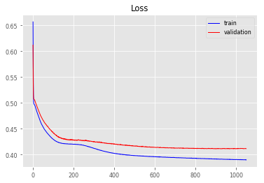


#### Plot accuracy during training


```python
plt.title('Accuracy')
plt.plot(classifier.history.history['acc'], label='train', color = 'blue', linewidth = 1)
plt.plot(classifier.history.history['val_acc'], label='validation', color = 'red', linewidth = 1)
plt.legend()
plt.show()
```


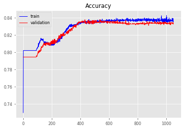


#### We just trained our artificial neural network on the training set and now it's time to make the prediction on the test set


```python
y_pred_trained = classifier.predict(X_test_minMaxScaled)

y_pred_for_confusionMatrix = (y_pred_trained[:,0] > 0.5).reshape(y_pred_trained.shape[0],1)
y_pred_for_confusionMatrix = np.where(y_pred_for_confusionMatrix == True, 1, 0)
y_test_for_confusionMatrix = y_test

from sklearn.metrics import confusion_matrix
cm = confusion_matrix(y_test_for_confusionMatrix, y_pred_for_confusionMatrix)

errorOnTestSetTrained = 100*(cm[0,1]+cm[1,0])/y_test.shape[0]

print("\nTime to manually train one network is ", time1,"seconds(",hours1,"hours,",minutes1,"minutes and ",seconds1,"seconds ).")

# CONFUSION MATRIX IMAGE
def plot_confusion_matrix(y_true, y_pred, classes,
                          normalize=False,
                          title=None,
                          cmap=plt.cm.Blues):
    if not title:
        if normalize:
            title = 'Normalized confusion matrix'
        else:
            title = 'Confusion matrix, without normalization'

    # Compute confusion matrix
    cm = confusion_matrix(y_true, y_pred)
    # Only use the labels that appear in the data
    classes = np.array(["Not Exited","Exited"])
    if normalize:
        cm = cm.astype('float') / cm.sum(axis=1)[:, np.newaxis]
        #print("Normalized confusion matrix")
    #else:
        #print('Confusion matrix, without normalization')

    #print(cm)

    fig, ax = plt.subplots()
    im = ax.imshow(cm, interpolation='nearest', cmap=cmap)
    ax.figure.colorbar(im, ax=ax);
    
    # We want to show all ticks...
    ax.set(xticks=np.arange(cm.shape[1]),
           yticks=np.arange(cm.shape[0]),
           # ... and label them with the respective list entries
           xticklabels=classes, yticklabels=classes,
           title=title,
           ylabel='True label',
           xlabel='Predicted label')

    # Rotate the tick labels and set their alignment.
    plt.setp(ax.get_xticklabels(), rotation=45, ha="right",
             rotation_mode="anchor")

    # Loop over data dimensions and create text annotations.
    fmt = '.2f' if normalize else 'd'
    thresh = cm.max() / 2.
    for i in range(cm.shape[0]):
        for j in range(cm.shape[1]):
            ax.text(j, i, format(cm[i, j], fmt),
                    ha="center", va="center",
                    color="white" if cm[i, j] > thresh else "black")
    fig.tight_layout()
    return ax


np.set_printoptions(precision=2)

class_names = np.array(["Not Exited","Exited"])
# Plot non-normalized confusion matrix
plot_confusion_matrix(y_test_for_confusionMatrix, y_pred_for_confusionMatrix, classes=class_names, normalize=False, title='Confusion matrix');
print("\nTest set error, which we can read in confusion matrix is",errorOnTestSetTrained,"%.")
```

    
    Time to manually train one network is  377 seconds( 0 hours, 6 minutes and  17 seconds ).
    
    Test set error, which we can read in confusion matrix is 17.6 %.
    


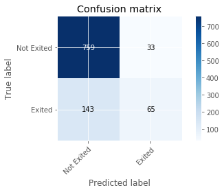


#### ROC curve and AUC


```python
from sklearn.metrics import roc_curve
from sklearn.metrics import roc_auc_score

# calculate AUC
auc = roc_auc_score(y_test, y_pred_trained)
# calculate roc curve
fpr, tpr, thresholds = roc_curve(y_test, y_pred_trained)
plt.plot([0, 1], [0, 1], linestyle='--', label='Random ROC')
plt.plot(fpr, tpr, label='Manual ROC (AUC = %.3f)' % auc)
plt.title('ROC Curve')
plt.xlabel('False Posive rate (FPR)')
plt.ylabel('True Posive rate (TPR)')
plt.legend(loc ='lower right')
plt.show()
```


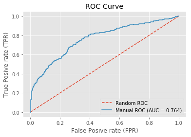


# Option 2 - Parameter tuning by Grid search
We have two type of model parameters, __the weights__ obtained during training process, and parameters that stay fixed, called the __hyperparameters__. The examples of th hyperparameters are __number of epochs__, __batch size__, __type of optimizer__, __number of layers__, __the number of neurons layers__ etc. The ANN trained in __Option 1__ used fixed values of these hyperparameters, but perhaps some other values would lead us to a better accuracy.

The parameter tuning is all about finding the best values of the hyperparameters. We will try this using a simple technique called __Grid search__ that will test several combinations of hyperparameter and return the best choice that leads to the best accuracy obtained by K-fold cross validation.


```python
from keras.wrappers.scikit_learn import KerasClassifier
from sklearn.model_selection import GridSearchCV
from keras.models import Sequential
from keras.layers import Dense

import time
start2 = time.time()

def build_classifier(optimizer):
   classifier = Sequential()
   classifier.add(Dense(units = 6, kernel_initializer = 'uniform', activation = 'sigmoid', input_dim = 11))
   classifier.add(Dense(units = 6, kernel_initializer = 'uniform', activation = 'sigmoid'))
   classifier.add(Dense(units = 1, kernel_initializer = 'uniform', activation = 'sigmoid'))
   classifier.compile(optimizer = optimizer, loss = 'binary_crossentropy', metrics = ['accuracy'])
   return classifier

Tuning_classifier = KerasClassifier(build_fn = build_classifier)
parameters = {'batch_size': [32, 64], 
              'epochs': [3000],
              'optimizer': ['adam', 'adadelta']
             }

grid_search = GridSearchCV(estimator = Tuning_classifier,
                           param_grid = parameters,
                           #scoring = 'accuracy',
                           cv = 5,
                          )

grid_search = grid_search.fit(X_train_minMaxScaled, y_train)

best_parameters = grid_search.best_params_
best_accuracy = grid_search.best_score_

print("Best parameters are :\n", best_parameters)
print("\nBest accuracy is :\n", best_accuracy)


end2 = time.time()

time2 = int(end2-start2)
minutes2, seconds2= divmod(time2, 60)
hours2, minutes2= divmod(minutes2, 60)
```

    Epoch 1/3000
    2000/2000 [==============================] - 5s 2ms/step - loss: 0.6657 - acc: 0.7315
    Epoch 2/3000
    2000/2000 [==============================] - 0s 81us/step - loss: 0.5979 - acc: 0.8065
    Epoch 3/3000
    2000/2000 [==============================] - 0s 83us/step - loss: 0.5420 - acc: 0.8065
    .
    .
    .
    
    Epoch 2998/3000
    4000/4000 [==============================] - 0s 41us/step - loss: 0.3827 - acc: 0.8375
    Epoch 2999/3000
    4000/4000 [==============================] - 0s 41us/step - loss: 0.3827 - acc: 0.8375
    Epoch 3000/3000
    4000/4000 [==============================] - 0s 41us/step - loss: 0.3827 - acc: 0.8375
    Best parameters are :
     {'batch_size': 64, 'epochs': 3000, 'optimizer': 'adadelta'}
    
    Best accuracy is :
     0.82875
    

#### Our optimized ANN resides in grid_search. Now it's time to make the prediction on the test set


```python
y_pred_tuning = grid_search.predict_proba(X_test_minMaxScaled)
y_pred_tuning = y_pred_tuning[:,1].reshape(y_pred_tuning.shape[0],1)

y_pred_tuning_for_confusionMatrix = (y_pred_tuning[:,0] > 0.5).reshape(y_pred_tuning.shape[0],1)
y_pred_tuning_for_confusionMatrix = np.where(y_pred_tuning_for_confusionMatrix == True, 1, 0)
y_test_for_confusionMatrix = y_test

from sklearn.metrics import confusion_matrix
cm = confusion_matrix(y_test_for_confusionMatrix, y_pred_tuning_for_confusionMatrix)

errorOnTestSetTuning = 100*(cm[0,1]+cm[1,0])/y_test.shape[0]

print("\nTime needed for tuning is ", time2,"seconds(",hours2,"hours,",minutes2,"minutes and ",seconds2,"seconds).")

# CONFUSION MATRIX IMAGE
def plot_confusion_matrix(y_true, y_pred, classes,
                          normalize=False,
                          title=None,
                          cmap=plt.cm.Blues):
    if not title:
        if normalize:
            title = 'Normalized confusion matrix'
        else:
            title = 'Confusion matrix, without normalization'

    # Compute confusion matrix
    cm = confusion_matrix(y_true, y_pred)
    # Only use the labels that appear in the data
    classes = np.array(["Not Exited","Exited"])
    if normalize:
        cm = cm.astype('float') / cm.sum(axis=1)[:, np.newaxis]
        #print("Normalized confusion matrix")
    #else:
        #print('Confusion matrix, without normalization')

    #print(cm)

    fig, ax = plt.subplots()
    im = ax.imshow(cm, interpolation='nearest', cmap=cmap)
    ax.figure.colorbar(im, ax=ax);
    
    # We want to show all ticks...
    ax.set(xticks=np.arange(cm.shape[1]),
           yticks=np.arange(cm.shape[0]),
           # ... and label them with the respective list entries
           xticklabels=classes, yticklabels=classes,
           title=title,
           ylabel='True label',
           xlabel='Predicted label')

    # Rotate the tick labels and set their alignment.
    plt.setp(ax.get_xticklabels(), rotation=45, ha="right",
             rotation_mode="anchor")

    # Loop over data dimensions and create text annotations.
    fmt = '.2f' if normalize else 'd'
    thresh = cm.max() / 2.
    for i in range(cm.shape[0]):
        for j in range(cm.shape[1]):
            ax.text(j, i, format(cm[i, j], fmt),
                    ha="center", va="center",
                    color="white" if cm[i, j] > thresh else "black")
    fig.tight_layout()
    return ax


np.set_printoptions(precision=2)

class_names = np.array(["Not Exited","Exited"])
# Plot non-normalized confusion matrix
plot_confusion_matrix(y_test_for_confusionMatrix, y_pred_tuning_for_confusionMatrix, classes=class_names, normalize=False, title='Confusion matrix');
print("\nTest set error with tuning, which we can read in confusion matrix is",errorOnTestSetTuning,"%.")
```

    
    Time needed for tuning is  19820 seconds( 5 hours, 30 minutes and  20 seconds).
    
    Test set error with tuning, which we can read in confusion matrix is 17.4 %.
    


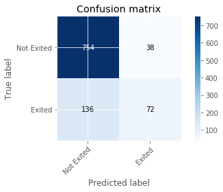


#### ROC curve and AUC


```python
from sklearn.metrics import roc_curve
from sklearn.metrics import roc_auc_score

# calculate AUC
auc = roc_auc_score(y_test, y_pred_tuning)
# calculate roc curve
fpr, tpr, thresholds = roc_curve(y_test, y_pred_tuning)
plt.plot([0, 1], [0, 1], linestyle='--', label='Random ROC')
plt.plot(fpr, tpr, label='Tuning ROC (AUC = %.3f)' % auc)
plt.title('ROC Curve')
plt.xlabel('False Posive rate (FPR)')
plt.ylabel('True Posive rate (TPR)')
plt.legend(loc ='lower right')
plt.show()
```


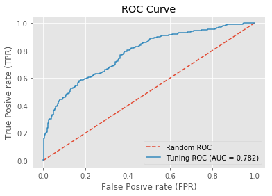


# Option 3 - Optimize ANN using Black Fox service

#### Install Black fox service


```python
!pip install blackfox
```

    Collecting blackfox
    [?25l  Downloading https://files.pythonhosted.org/packages/d8/38/94ed8bfac47306f510ba6c14dd5e18199536329c3c76b955399bb87b0c22/blackfox-0.0.3-py3-none-any.whl (45kB)
        100% |████████████████████████████████| 51kB 2.7MB/s ta 0:00:011
    [?25hRequirement already satisfied: six>=1.10 in /home/nbuser/anaconda3_501/lib/python3.6/site-packages (from blackfox) (1.11.0)
    Requirement already satisfied: python-dateutil in /home/nbuser/anaconda3_501/lib/python3.6/site-packages (from blackfox) (2.7.5)
    Requirement already satisfied: certifi in /home/nbuser/anaconda3_501/lib/python3.6/site-packages (from blackfox) (2018.10.15)
    Requirement already satisfied: urllib3>=1.15 in /home/nbuser/anaconda3_501/lib/python3.6/site-packages (from blackfox) (1.23)
    Installing collected packages: blackfox
    Successfully installed blackfox-0.0.3
    You are using pip version 19.0.3, however version 19.1 is available.
    You should consider upgrading via the 'pip install --upgrade pip' command.
    

#### Let's run the Black Fox service to find best ANN for the specific problem. Note that we optimize the architecture, as well!


```python
# Importing the BF service libraries and other libraries
from blackfox import BlackFox
from blackfox import KerasOptimizationConfig
from blackfox import OptimizationEngineConfig
import h5py
#from keras.models import load_model
#import numpy as np
#import pandas as pd

blackfox_url = 'http://*******************'
bf = BlackFox(blackfox_url)

ec = OptimizationEngineConfig(proc_timeout_miliseconds=2000000, population_size=50, max_num_of_generations=20)
c = KerasOptimizationConfig(engine_config=ec, max_epoch =3000, validation_split=0.3, problem_type="BinaryClassification")

import time
start3 = time.time()

# Use CTRL + C to stop optimization
(ann_io, ann_info, ann_metadata) = bf.optimize_keras_sync(
    input_set = X_train,
    output_set = y_train,
    config = c,
    integrate_scaler=False,
    network_path='OptimizedANNChurn_5k_1.h5'
)

end3 = time.time()
time3 = int(end3-start3)

print('\nann info:')
print(ann_info)

print('\nann metadata:')
print(ann_metadata)
```

    Use CTRL + C to stop optimization
    Uploading data set
    Starting...
    2019-04-25 06:25:52.566953 -> Active, Generation: 0/20, Validation set error: 0.000000, Training set error: 0.000000, Epoch: 0, Optimization Id: bc0beade-8f20-44e4-8988-57939408880a
    2019-04-25 06:43:36.994987 -> Active, Generation: 1/20, Validation set error: 0.351420, Training set error: 0.353619, Epoch: 113, Optimization Id: bc0beade-8f20-44e4-8988-57939408880a
    .
    .
    .
    2019-04-25 08:00:14.384631 -> Stopped, Generation: 19/20, Validation set error: 0.350685, Training set error: 0.330486, Epoch: 1025, Optimization Id: bc0beade-8f20-44e4-8988-57939408880a
    stopped Stopped
    Downloading network becd7ab836489a7d3af0e713891e28fdd15bb1d1
    Saving network becd7ab836489a7d3af0e713891e28fdd15bb1d1 to OptimizedANNChurn_With5k.h5
    
    ann info:
    {'dropout': 0.07,
     'hidden_layers': [{'activation_function': 'selu', 'neuron_count': 10}],
     'id': 'becd7ab836489a7d3af0e713891e28fdd15bb1d1',
     'output_layer_activation_function': 'Sigmoid',
     'training_algorithm': 'Nadam'}
    
    ann metadata:
    {'__version': 1, 'is_scaler_integrated': False, 'scaler_config': {'input': {'feature_range': [-1, 1], 'fit': [[0.0, 0.0, 350.0, 0.0, 18.0, 0.0, 0.0, 1.0, 0.0, 0.0, 90.07], [1.0, 1.0, 850.0, 1.0, 92.0, 10.0, 222267.63, 4.0, 1.0, 1.0, 199970.74]], 'inverse_transform': False}, 'output': {'feature_range': [0, 1], 'fit': [[0.0], [1.0]], 'inverse_transform': True}}, 'scaler_name': 'MinMaxScaler'}
    

#### The data set passed to the Black Fox service was not scaled since Black Fox scales inputs automatically. In order to apply obtained ANN in prediction, BlackFox offers the utility function to scale our test set the same way.


```python
# Get metadata
meta = bf.get_metadata('OptimizedANNChurn_5k_1.h5')
scaler_config = meta['scaler_config']

# Scale
x_scaler_config = scaler_config['input']
from sklearn.preprocessing import MinMaxScaler 
min_max_x = MinMaxScaler(feature_range=x_scaler_config['feature_range'])
min_max_x.fit(x_scaler_config['fit'])

X_test_minMaxScaled_withBF = min_max_x.transform(X_test)
```

#### Prediction using ANN proposed by Black Fox


```python
# Importing ANN model
from keras.models import load_model
model = load_model('OptimizedANNChurn_5k_1.h5')

# Predicted values
y_pred_BF=model.predict(X_test_minMaxScaled_withBF)
```

#### Rescale


```python
# Rescale
y_scaler_config = scaler_config['output']
min_max_y = MinMaxScaler(feature_range=y_scaler_config['feature_range'])
min_max_y.fit(y_scaler_config['fit'])

y_pred_BF_realValues = min_max_y.inverse_transform(y_pred_BF)
```

#### Compute error


```python
y_pred_BF_for_confusionMatrix = (y_pred_BF_realValues[:,0] > 0.5).reshape(y_pred_BF_realValues.shape[0],1)
y_pred_BF_for_confusionMatrix = np.where(y_pred_BF_for_confusionMatrix == True, 1, 0)
y_test_for_confusionMatrix = y_test

from sklearn.metrics import confusion_matrix
cm = confusion_matrix(y_test_for_confusionMatrix, y_pred_BF_for_confusionMatrix)

errorOnTestSetBF = 100*(cm[0,1]+cm[1,0])/y_test.shape[0]

print("\nTime for finding the best ANN by Black Fox service is ", time3,"seconds(",hours3,"hours,",minutes3,"minutes and ",seconds3,"seconds).")

# CONFUSION MATRIX IMAGE
def plot_confusion_matrix(y_true, y_pred, classes,
                          normalize=False,
                          title=None,
                          cmap=plt.cm.Blues):
    if not title:
        if normalize:
            title = 'Normalized confusion matrix'
        else:
            title = 'Confusion matrix, without normalization'

    # Compute confusion matrix
    cm = confusion_matrix(y_true, y_pred)
    # Only use the labels that appear in the data
    classes = np.array(["Not Exited","Exited"])
    if normalize:
        cm = cm.astype('float') / cm.sum(axis=1)[:, np.newaxis]
        #print("Normalized confusion matrix")
    #else:
        #print('Confusion matrix, without normalization')

    #print(cm)

    fig, ax = plt.subplots()
    im = ax.imshow(cm, interpolation='nearest', cmap=cmap)
    ax.figure.colorbar(im, ax=ax);
    
    # We want to show all ticks...
    ax.set(xticks=np.arange(cm.shape[1]),
           yticks=np.arange(cm.shape[0]),
           # ... and label them with the respective list entries
           xticklabels=classes, yticklabels=classes,
           title=title,
           ylabel='True label',
           xlabel='Predicted label')

    # Rotate the tick labels and set their alignment.
    plt.setp(ax.get_xticklabels(), rotation=45, ha="right",
             rotation_mode="anchor")

    # Loop over data dimensions and create text annotations.
    fmt = '.2f' if normalize else 'd'
    thresh = cm.max() / 2.
    for i in range(cm.shape[0]):
        for j in range(cm.shape[1]):
            ax.text(j, i, format(cm[i, j], fmt),
                    ha="center", va="center",
                    color="white" if cm[i, j] > thresh else "black")
    fig.tight_layout()
    #plt.savefig("Churn_grafici/grafik_4.png")
    #plt.savefig("Churn_grafici/grafik_4.svg")
    return ax


np.set_printoptions(precision=2)

class_names = np.array(["Not Exited","Exited"])
# Plot non-normalized confusion matrix
plot_confusion_matrix(y_test_for_confusionMatrix, y_pred_BF_for_confusionMatrix, classes=class_names, normalize=False, title='Confusion matrix');
print("\nTest set error for finding the best ANN by Black Fox service, which we can read in confusion matrix is",errorOnTestSetBF,"%.")
```

    
    Time for finding the best ANN by Black Fox service is  5670 seconds( 1 hours, 34 minutes and  30 seconds).
    
    Test set error for finding the best ANN by Black Fox service, which we can read in confusion matrix is 14.7 %.
    


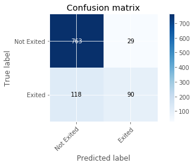


#### ROC curve and AUC


```python
# roc curve and auc
from sklearn.metrics import roc_curve
from sklearn.metrics import roc_auc_score

# calculate AUC
auc = roc_auc_score(y_test, y_pred_BF_realValues)
# calculate roc curve
fpr, tpr, thresholds = roc_curve(y_test, y_pred_BF_realValues)
plt.plot([0, 1], [0, 1], linestyle='--', label='Random ROC')
plt.plot(fpr, tpr, label='Black Fox ROC (AUC = %.3f)' % auc)
plt.title('ROC Curve')
plt.xlabel('False Posive rate (FPR)')
plt.ylabel('True Posive rate (TPR)')
plt.legend(loc ='lower right')
plt.show()
```


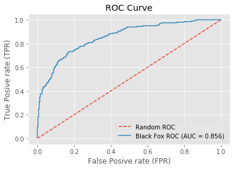


# RESULTS AND DISCUSSION


```python
# Comparison
from sklearn.metrics import roc_auc_score, roc_curve
auc_manual = roc_auc_score(y_test, y_pred_trained)
auc_tuned = roc_auc_score(y_test, y_pred_tuning)
auc_BF = roc_auc_score(y_test, y_pred_BF_realValues)

fpr_manual, tpr_manual, thresholds_manual = roc_curve(y_test, y_pred_trained)
fpr_tuned, tpr_tuned, thresholds_tuned = roc_curve(y_test, y_pred_tuning)
fpr_BF, tpr_BF, thresholds_BF = roc_curve(y_test, y_pred_BF_realValues)

plt.figure(figsize=(8,8))
plt.plot([0, 1], [0, 1], linestyle='--', label='Random ROC');
plt.plot(fpr_manual, tpr_manual, label='Manual ROC (AUC = %.4f)' % auc_manual);
plt.plot(fpr_tuned, tpr_tuned, label='Tuning ROC (AUC = %.4f)' % auc_tuned, color = 'orange');
plt.plot(fpr_BF, tpr_BF, label='Black Fox ROC (AUC = %.4f)' % auc_BF);
plt.title('ROC Curve - Comparison');
plt.xlabel('False Posive rate (FPR)');
plt.ylabel('True Posive rate (TPR)');
plt.legend(loc='lower right');
```


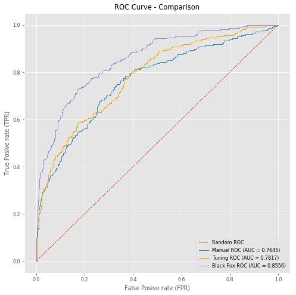


```python
plt.style.use('ggplot')
mpl.rc('lines', linewidth=1)
mpl.rc('font', size='8')

n_groups = 3
group_1 = (Human_time1/3600, Human_time2/3600, Human_time3/3600)
group_2 = (time1/3600, time2/3600, time3/3600)
group_3 = (errorOnTestSetTrained, errorOnTestSetTuning, errorOnTestSetBF)

# Create plot
fig, ax = plt.subplots(figsize=(6.5,7))
ax.xaxis.grid(False)
index = np.arange(n_groups)
bar_width = 0.2
space = 0.05
opacity = 1


rects1 = plt.bar(index, group_1, bar_width, color = 'orange',
alpha=opacity,
label='Human effort ( h )')

rects2 = plt.bar(index, group_2, bar_width, bottom =group_1, color = (0.1, 0.55, 0.77),
alpha=opacity,
label='Execution time ( h )')

rects3 = plt.bar(index + bar_width+space, group_3, bar_width, color = 'red',
alpha=opacity,
label='Error ( % )')


plt.title('Comparison')
plt.xticks(index + (bar_width/2 + space/2), ('Manual', 'Optimized', 'Black Fox service'))
plt.legend(loc = (0.376,-0.2))
 
plt.tight_layout()
plt.show()
```


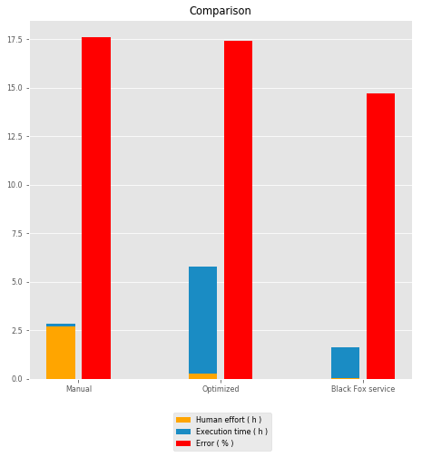


#### Although we measured this three options, actually they are not so comparable, because in Python we had a man sitting in office and programming those neural networks (options 1 and 2) while in Black Fox service (option 3), he imported the same data set and the service did the rest, while he went to rest or dring coffe, for example, so actually, in Black Fox service he wrote few lines of code and thats all of hard work. Results in the given plots above speak for themself. As you can see, Black Fox service gave better results in less time and effort to create approximate results in Python as Black Fox did is immeasurably large.
