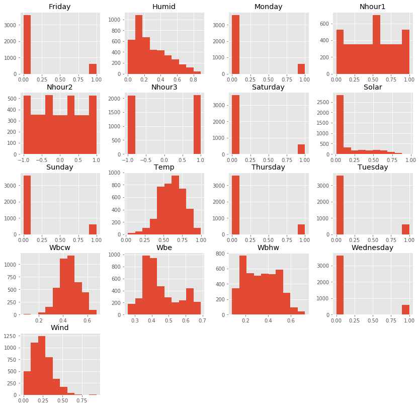
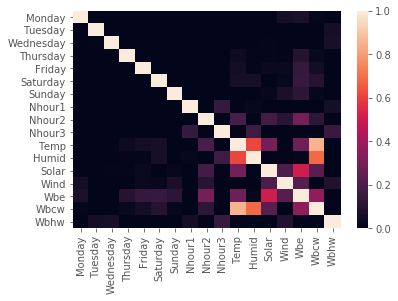
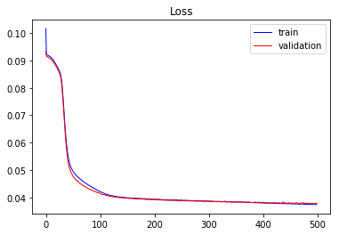
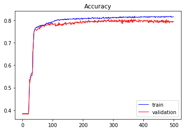
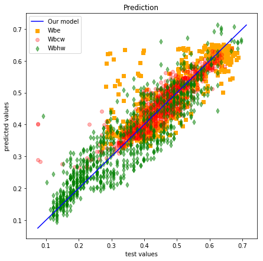
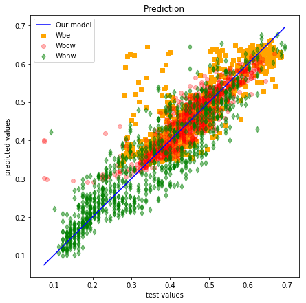
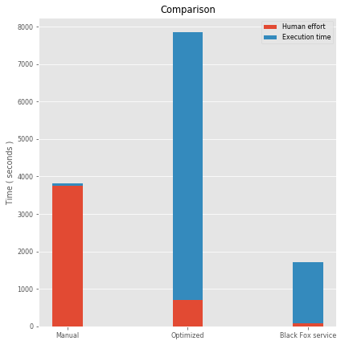
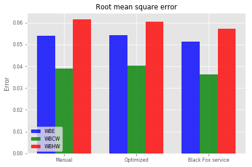
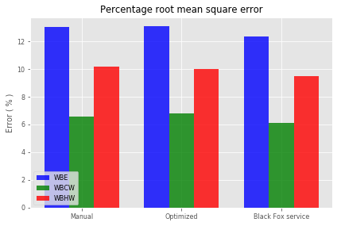

# Building
  
### Problem explanation:

Prediction of energy consumption in a building. Try to predict the hourly consumption of electrical energy, hot water, and cold water, based on the date, time of day, outside temperature, outside air humidity, solar radiation, and wind speed.
The data set was created based on problem A of “The Great Energy Predictor Shootout - the first building data analysis and prediction problem” contest, organized in 1993 for the ASHRAE мeeting in Denver, Colorado. The data set itself is located here, in the field building.

This is regression problem and the results  are three outputs, hourly consumption of electrical energy, hot water, and cold water. Model inputs are:
 
* Day,
* Hour,
* Temperature,
* Humidity,
* Solar radiation,
* Wind speed.

### Problem solution:
Data set contains 4208 observations,we have divided the data set in two sets, training set, which contains 3366 observations and test set, which contains 842 observations. We solved problem in three ways:

* Manually buiilding ANN,
* Tune some hyperparameters by using grid search and
* Employing Black Fox service.

We evaluate the performance of the models using K-fold cross validation. For the purpose of feature scaling, we apply a min max scaler. To stop the training at the right time, Keras' early stopping scheme is applied.


### Update Keras to latest version


```python
!pip install keras==2.2.4
```

    Requirement already satisfied: keras==2.2.4 in /home/nbuser/anaconda3_501/lib/python3.6/site-packages (2.2.4)
    Requirement already satisfied: keras-applications>=1.0.6 in /home/nbuser/anaconda3_501/lib/python3.6/site-packages (from keras==2.2.4) (1.0.7)
    Requirement already satisfied: pyyaml in /home/nbuser/anaconda3_501/lib/python3.6/site-packages (from keras==2.2.4) (3.13)
    Requirement already satisfied: h5py in /home/nbuser/anaconda3_501/lib/python3.6/site-packages (from keras==2.2.4) (2.8.0)
    Requirement already satisfied: six>=1.9.0 in /home/nbuser/anaconda3_501/lib/python3.6/site-packages (from keras==2.2.4) (1.11.0)
    Requirement already satisfied: numpy>=1.9.1 in /home/nbuser/anaconda3_501/lib/python3.6/site-packages (from keras==2.2.4) (1.14.6)
    Requirement already satisfied: scipy>=0.14 in /home/nbuser/anaconda3_501/lib/python3.6/site-packages (from keras==2.2.4) (1.1.0)
    Requirement already satisfied: keras-preprocessing>=1.0.5 in /home/nbuser/anaconda3_501/lib/python3.6/site-packages (from keras==2.2.4) (1.0.9)
    

# Data preprocessing
#### Importing data frame


```python
# Importing the libraries
import numpy as np
import matplotlib.pyplot as plt
import pandas as pd
import seaborn as sns
import matplotlib as mpl
plt.style.use('ggplot')

dataframe = pd.read_csv('BuildingData.csv')
```

#### Dataset info


```python
dataframe.info()
```

    <class 'pandas.core.frame.DataFrame'>
    RangeIndex: 4208 entries, 0 to 4207
    Data columns (total 17 columns):
    Monday       4208 non-null int64
    Tuesday      4208 non-null int64
    Wednesday    4208 non-null int64
    Thursday     4208 non-null int64
    Friday       4208 non-null int64
    Saturday     4208 non-null int64
    Sunday       4208 non-null int64
    Nhour1       4208 non-null float64
    Nhour2       4208 non-null float64
    Nhour3       4208 non-null int64
    Temp         4208 non-null float64
    Humid        4208 non-null float64
    Solar        4208 non-null float64
    Wind         4208 non-null float64
    Wbe          4208 non-null float64
    Wbcw         4208 non-null float64
    Wbhw         4208 non-null float64
    dtypes: float64(9), int64(8)
    memory usage: 559.0 KB
    

#### Dataset description


```python
dataframe.describe()
```


<div>
<style scoped>
    .dataframe tbody tr th:only-of-type {
        vertical-align: middle;
    }

    .dataframe tbody tr th {
        vertical-align: top;
    }

    .dataframe thead th {
        text-align: right;
    }
</style>
<table border="1" class="dataframe">
  <thead>
    <tr style="text-align: right;">
      <th></th>
      <th>Monday</th>
      <th>Tuesday</th>
      <th>Wednesday</th>
      <th>Thursday</th>
      <th>Friday</th>
      <th>Saturday</th>
      <th>Sunday</th>
      <th>Nhour1</th>
      <th>Nhour2</th>
      <th>Nhour3</th>
      <th>Temp</th>
      <th>Humid</th>
      <th>Solar</th>
      <th>Wind</th>
      <th>Wbe</th>
      <th>Wbcw</th>
      <th>Wbhw</th>
    </tr>
  </thead>
  <tbody>
    <tr>
      <th>count</th>
      <td>4208.000000</td>
      <td>4208.000000</td>
      <td>4208.000000</td>
      <td>4208.000000</td>
      <td>4208.000000</td>
      <td>4208.000000</td>
      <td>4208.000000</td>
      <td>4208.000000</td>
      <td>4208.000000</td>
      <td>4208.000000</td>
      <td>4208.000000</td>
      <td>4208.000000</td>
      <td>4208.000000</td>
      <td>4208.000000</td>
      <td>4208.000000</td>
      <td>4208.000000</td>
      <td>4208.000000</td>
    </tr>
    <tr>
      <th>mean</th>
      <td>0.144487</td>
      <td>0.142586</td>
      <td>0.142586</td>
      <td>0.142586</td>
      <td>0.142586</td>
      <td>0.142586</td>
      <td>0.142586</td>
      <td>0.500079</td>
      <td>-0.000992</td>
      <td>0.001901</td>
      <td>0.609596</td>
      <td>0.282694</td>
      <td>0.149780</td>
      <td>0.236274</td>
      <td>0.450551</td>
      <td>0.451385</td>
      <td>0.339658</td>
    </tr>
    <tr>
      <th>std</th>
      <td>0.351624</td>
      <td>0.349691</td>
      <td>0.349691</td>
      <td>0.349691</td>
      <td>0.349691</td>
      <td>0.349691</td>
      <td>0.349691</td>
      <td>0.290556</td>
      <td>0.601920</td>
      <td>1.000117</td>
      <td>0.162364</td>
      <td>0.199956</td>
      <td>0.225103</td>
      <td>0.125516</td>
      <td>0.104934</td>
      <td>0.085478</td>
      <td>0.144851</td>
    </tr>
    <tr>
      <th>min</th>
      <td>0.000000</td>
      <td>0.000000</td>
      <td>0.000000</td>
      <td>0.000000</td>
      <td>0.000000</td>
      <td>0.000000</td>
      <td>0.000000</td>
      <td>0.000000</td>
      <td>-1.000000</td>
      <td>-1.000000</td>
      <td>0.026000</td>
      <td>0.000000</td>
      <td>0.008774</td>
      <td>0.000000</td>
      <td>0.259145</td>
      <td>0.075000</td>
      <td>0.081818</td>
    </tr>
    <tr>
      <th>25%</th>
      <td>0.000000</td>
      <td>0.000000</td>
      <td>0.000000</td>
      <td>0.000000</td>
      <td>0.000000</td>
      <td>0.000000</td>
      <td>0.000000</td>
      <td>0.250000</td>
      <td>-0.565217</td>
      <td>-1.000000</td>
      <td>0.494000</td>
      <td>0.127860</td>
      <td>0.010377</td>
      <td>0.148214</td>
      <td>0.374563</td>
      <td>0.397500</td>
      <td>0.204545</td>
    </tr>
    <tr>
      <th>50%</th>
      <td>0.000000</td>
      <td>0.000000</td>
      <td>0.000000</td>
      <td>0.000000</td>
      <td>0.000000</td>
      <td>0.000000</td>
      <td>0.000000</td>
      <td>0.500000</td>
      <td>-0.043478</td>
      <td>1.000000</td>
      <td>0.620000</td>
      <td>0.225680</td>
      <td>0.012358</td>
      <td>0.221965</td>
      <td>0.415665</td>
      <td>0.450000</td>
      <td>0.337500</td>
    </tr>
    <tr>
      <th>75%</th>
      <td>0.000000</td>
      <td>0.000000</td>
      <td>0.000000</td>
      <td>0.000000</td>
      <td>0.000000</td>
      <td>0.000000</td>
      <td>0.000000</td>
      <td>0.750000</td>
      <td>0.478261</td>
      <td>1.000000</td>
      <td>0.727000</td>
      <td>0.413330</td>
      <td>0.207146</td>
      <td>0.309286</td>
      <td>0.522325</td>
      <td>0.510000</td>
      <td>0.460227</td>
    </tr>
    <tr>
      <th>max</th>
      <td>1.000000</td>
      <td>1.000000</td>
      <td>1.000000</td>
      <td>1.000000</td>
      <td>1.000000</td>
      <td>1.000000</td>
      <td>1.000000</td>
      <td>1.000000</td>
      <td>1.000000</td>
      <td>1.000000</td>
      <td>0.995000</td>
      <td>0.888000</td>
      <td>0.976415</td>
      <td>0.938571</td>
      <td>0.689082</td>
      <td>0.675000</td>
      <td>0.726136</td>
    </tr>
  </tbody>
</table>
</div>


#### Histograms of the numerical features


```python
dataframe.hist(figsize=(14,14));
```





#### Corelation heatmap


```python
sns.heatmap(dataframe.corr(), vmin=0, vmax=1);
```





####  Separate the data frame into feature matrix X and dependent variable y


```python
X = dataframe.iloc[:, 0:14].values
y = dataframe.iloc[:, 14:17].values

# To avoid dummy variable trap we remove column.
X = X[:, 1:]
```

#### Split the entire data set into the training set and test set


```python
from sklearn.model_selection import train_test_split
X_train, X_test, y_train, y_test = train_test_split(X, y, test_size = 0.2, random_state = 1)
```

#### Apply the feature scaling because we don't wanna have any feature dominating another feature


```python
# Min Max Scaler
from sklearn.preprocessing import MinMaxScaler

scaler = MinMaxScaler()
X_train_minMaxScaled = scaler.fit_transform(X_train)
X_test_minMaxScaled = scaler.transform(X_test)
```

# Option 1 - manually build ANN using Keras


```python
# Importing the keras libraries and packages
import keras
from keras.models import Sequential
from keras.layers import Dense
from keras.callbacks import Callback, TensorBoard, ModelCheckpoint
from keras.callbacks import EarlyStopping

import time
start1 = time.time()

classifier = Sequential()
classifier.add(Dense(units = 9, kernel_initializer = 'uniform', activation = 'sigmoid', input_dim = 13))
classifier.add(Dense(units = 9, kernel_initializer = 'uniform', activation = 'sigmoid'))
classifier.add(Dense(units = 3, kernel_initializer = 'uniform', activation = 'sigmoid'))
es = EarlyStopping(monitor = 'val_loss',
                   mode = 'auto',
                   #min_delta = 0,
                   patience = 30,
                   verbose = 1,
                   #baseline=0.4,
                   restore_best_weights = True
                  )
classifier.compile(optimizer = 'adam', loss = 'mean_absolute_error', metrics = ['accuracy'])
classifier.fit(x = X_train_minMaxScaled, y = y_train, validation_split = 0.3, batch_size = 32, epochs = 500, callbacks = [es], verbose=1)

end1 = time.time()

time1 = int(end1-start1)
minutes1, seconds1= divmod(time1, 60)
hours1, minutes1= divmod(minutes1, 60)
```

    Using TensorFlow backend.
    

    Train on 2356 samples, validate on 1010 samples
    Epoch 1/500
    2356/2356 [==============================] - 1s 265us/step - loss: 0.1016 - acc: 0.3846 - val_loss: 0.0933 - val_acc: 0.3822
    Epoch 2/500
    2356/2356 [==============================] - 0s 104us/step - loss: 0.0926 - acc: 0.3846 - val_loss: 0.0915 - val_acc: 0.3822
    Epoch 3/500
    2356/2356 [==============================] - 0s 112us/step - loss: 0.0920 - acc: 0.3846 - val_loss: 0.0913 - val_acc: 0.3822
    .
    .
    .
    Epoch 498/500
    2356/2356 [==============================] - 0s 62us/step - loss: 0.0373 - acc: 0.8145 - val_loss: 0.0379 - val_acc: 0.7960
    Epoch 499/500
    2356/2356 [==============================] - 0s 62us/step - loss: 0.0374 - acc: 0.8154 - val_loss: 0.0377 - val_acc: 0.7921
    Epoch 500/500
    2356/2356 [==============================] - 0s 68us/step - loss: 0.0374 - acc: 0.8171 - val_loss: 0.0378 - val_acc: 0.7941
    

#### Plot loss during training


```python
plt.title('Loss')
plt.plot(classifier.history.history['loss'], label = 'train', color = 'blue', linewidth=1)
plt.plot(classifier.history.history['val_loss'], label = 'validation', color = 'red', linewidth=1)
plt.legend()
plt.show()
```





#### Plot accuracy during training


```python
plt.title('Accuracy')
plt.plot(classifier.history.history['acc'], label='train', color = 'blue', linewidth=1)
plt.plot(classifier.history.history['val_acc'], label='validation', color = 'red', linewidth=1)
plt.legend()
plt.show()
```





#### We just trained our artificial neural network on the training set and now it's time to make the prediction on the test set


```python
y_pred_trained = classifier.predict(X_test_minMaxScaled)
#print("Predicted values are:\n\n", y_pred_trained[:10,:])

t1=y_pred_trained - y_test
t2=np.square(t1)

t21=t2[:,0:1]
t22=t2[:,1:2]
t23=t2[:,2:3]

t31=t21.sum()
t32=t22.sum()
t33=t23.sum()

t41=t31/y_test.shape[0]
t42=t32/y_test.shape[0]
t43=t33/y_test.shape[0]

Rmse1_trained = np.sqrt(t41)
Rmse2_trained = np.sqrt(t42)
Rmse3_trained = np.sqrt(t43)

t_max1 = np.max(y_test[:,0:1])
t_min1 = np.min(y_test[:,0:1])
t_max2 = np.max(y_test[:,1:2])
t_min2 = np.min(y_test[:,1:2])
t_max3 = np.max(y_test[:,2:3])
t_min3 = np.min(y_test[:,2:3])

Prmse1_trained = 100 * (Rmse1_trained / (t_max1 - t_min1))
Prmse2_trained = 100 * (Rmse2_trained / (t_max2 - t_min2))
Prmse3_trained = 100 * (Rmse3_trained / (t_max3 - t_min3))

print("\nTime to manually train one network is ", time1,"seconds(",hours1,"hours,",minutes1,"minutes and ",seconds1,"seconds ).")
print("\nRmse(WBE) = ",Rmse1_trained)
print("Rmse(WBCW) = ",Rmse2_trained)
print("Rmse(WBHW) = ",Rmse3_trained)
print("\nPrmse(WBE) = ",Prmse1_trained)
print("Prmse(WBCW) = ",Prmse2_trained)
print("Prmse(WBHW) = ",Prmse3_trained)
```

    
    Time to manually train one network is  76 seconds( 0 hours, 1 minutes and  16 seconds ).
    
    Rmse(WBE) =  0.05404059685242297
    Rmse(WBCW) =  0.038942159539989675
    Rmse(WBHW) =  0.061347121854048364
    
    Prmse(WBE) =  13.013677419549916
    Prmse(WBCW) =  6.572516378057329
    Prmse(WBHW) =  10.166747764834389
    

#### Visualisation:


```python
plt.figure(1, figsize=(7,7))
plt.scatter(y_test[:,0],y_pred_trained[:,0], color = 'orange', marker = 's', alpha = 1, label = 'Wbe')
plt.scatter(y_test[:,1],y_pred_trained[:,1], color = 'red', marker = 'o', alpha = 0.3, label = 'Wbcw')
plt.scatter(y_test[:,2],y_pred_trained[:,2], color = 'green', marker = 'd', alpha = 0.5, label = 'Wbhw')
plt.title('Prediction')
plt.xlabel('test values')
plt.ylabel('predicted values')
_=plt.plot([min(np.min(y_test),np.min(y_pred_trained)), max(np.max(y_test),np.max(y_pred_trained))],[min(np.min(y_test),np.min(y_pred_trained)), max(np.max(y_test),np.max(y_pred_trained))], color = 'blue', alpha = 1, label = 'Our model')
plt.legend(loc = 'upper left');
```





# Option 2 - Parameter tuning by Grid search
We have two type of model parameters, __the weights__ obtained during training process, and parameters that stay fixed, called the __hyperparameters__. The examples of th hyperparameters are __number of epochs__, __batch size__, __type of optimizer__, __number of layers__, __the number of neurons layers__ etc. The ANN trained in __Option 1__ used fixed values of these hyperparameters, but perhaps some other values would lead us to a better accuracy.

The parameter tuning is all about finding the best values of the hyperparameters. We will try this using a simple technique called __Grid search__ that will test several combinations of hyperparameter and return the best choice that leads to the best accuracy obtained by K-fold cross validation.


```python
from keras.wrappers.scikit_learn import KerasClassifier
from sklearn.model_selection import GridSearchCV
from keras.models import Sequential
from keras.layers import Dense

import time
start2 = time.time()

def build_classifier(optimizer):
   classifier = Sequential()
   classifier.add(Dense(units = 9, kernel_initializer = 'uniform', activation = 'sigmoid', input_dim = 13))
   classifier.add(Dense(units = 9, kernel_initializer = 'uniform', activation = 'sigmoid'))
   classifier.add(Dense(units = 3, kernel_initializer = 'uniform', activation = 'sigmoid'))
   classifier.compile(optimizer = optimizer, loss = 'mean_absolute_error', metrics = ['accuracy'])
   return classifier

Tuning_classifier = KerasClassifier(build_fn = build_classifier)
parameters = {'batch_size': [25, 32],
              'epochs': [100, 500],
              'optimizer': ['adam', 'rmsprop']
             }

grid_search = GridSearchCV(estimator = Tuning_classifier,
                           param_grid = parameters,
                           #scoring = 'accuracy',
                           cv = 10,
                          )

grid_search = grid_search.fit(X_train_minMaxScaled, y_train)

best_parameters = grid_search.best_params_
best_accuracy = grid_search.best_score_

print("Best parameters are :\n", best_parameters)
print("\nBest accuracy is :\n", best_accuracy)


end2 = time.time()

time2 = int(end2-start2)
minutes2, seconds2= divmod(time2, 60)
hours2, minutes2= divmod(minutes2, 60)

print("\nTime training one network is ", time2,"seconds(",hours2,"hours,",minutes2,"minutes and ",seconds2,"seconds).")
```

    Epoch 1/100
    3029/3029 [==============================] - 0s 137us/step - loss: 0.0982 - acc: 0.3688
    Epoch 2/100
    3029/3029 [==============================] - 0s 59us/step - loss: 0.0919 - acc: 0.3840
    Epoch 3/100
    3029/3029 [==============================] - 0s 55us/step - loss: 0.0917 - acc: 0.3840
    .
    .
    .
    Epoch 498/500
    3366/3366 [==============================] - 0s 114us/step - loss: 0.0372 - acc: 0.8149
    Epoch 499/500
    3366/3366 [==============================] - 0s 96us/step - loss: 0.0372 - acc: 0.8143
    Epoch 500/500
    3366/3366 [==============================] - 0s 98us/step - loss: 0.0372 - acc: 0.8167
    Best parameters are :
     {'batch_size': 32, 'epochs': 500, 'optimizer': 'adam'}
    
    Best accuracy is :
     0.32055852653163214
    
    Time training one network is  7144 seconds( 1 hours, 59 minutes and  4 seconds).
    

#### Our optimized ANN resides in grid_search. Now it's time to make the prediction on the test set


```python
y_pred_tuning = grid_search.predict_proba(X_test_minMaxScaled)
#print("Predicted values are:\n\n", y_pred_tuning[:10,:])

t1=y_pred_tuning - y_test
t2=np.square(t1)

t21=t2[:,0:1]
t22=t2[:,1:2]
t23=t2[:,2:3]

t31=t21.sum()
t32=t22.sum()
t33=t23.sum()

t41=t31/y_test.shape[0]
t42=t32/y_test.shape[0]
t43=t33/y_test.shape[0]

Rmse1_tuning = np.sqrt(t41)
Rmse2_tuning = np.sqrt(t42)
Rmse3_tuning = np.sqrt(t43)

t_max1 = np.max(y_test[:,0:1])
t_min1 = np.min(y_test[:,0:1])
t_max2 = np.max(y_test[:,1:2])
t_min2 = np.min(y_test[:,1:2])
t_max3 = np.max(y_test[:,2:3])
t_min3 = np.min(y_test[:,2:3])

Prmse1_tuning = 100 * (Rmse1_tuning / (t_max1 - t_min1))
Prmse2_tuning = 100 * (Rmse2_tuning / (t_max2 - t_min2))
Prmse3_tuning = 100 * (Rmse3_tuning / (t_max3 - t_min3))

print("\nTime needed for tuning is ", time2,"seconds(",hours2,"hours,",minutes2,"minutes and ",seconds2,"seconds).")
print("\nRmse(WBE) = ",Rmse1_tuning)
print("Rmse(WBCW) = ",Rmse2_tuning)
print("Rmse(WBHW) = ",Rmse3_tuning)
print("\nPrmse(WBE) = ",Prmse1_tuning)
print("Prmse(WBCW) = ",Prmse2_tuning)
print("Prmse(WBHW) = ",Prmse3_tuning)
```

    
    Time needed for tuning is  7144 seconds( 1 hours, 59 minutes and  4 seconds).
    
    Rmse(WBE) =  0.05420678561614596
    Rmse(WBCW) =  0.0402420110770949
    Rmse(WBHW) =  0.06042263827405371
    
    Prmse(WBE) =  13.053697831755038
    Prmse(WBCW) =  6.791900603729097
    Prmse(WBHW) =  10.013537783885356
    

#### Visualisation:


```python
plt.figure(1, figsize=(7,7))
plt.scatter(y_test[:,0],y_pred_tuning[:,0], color = 'orange', marker = 's', alpha = 1, label = 'Wbe')
plt.scatter(y_test[:,1],y_pred_tuning[:,1], color = 'red', marker = 'o', alpha = 0.3, label = 'Wbcw')
plt.scatter(y_test[:,2],y_pred_tuning[:,2], color = 'green', marker = 'd', alpha = 0.5, label = 'Wbhw')
plt.title('Prediction')
plt.xlabel('test values')
plt.ylabel('predicted values')
_=plt.plot([min(np.min(y_test),np.min(y_pred_tuning)), max(np.max(y_test),np.max(y_pred_tuning))],[min(np.min(y_test),np.min(y_pred_tuning)), max(np.max(y_test),np.max(y_pred_tuning))], color = 'blue', alpha = 1, label = 'Our model')
plt.legend(loc = 'upper left');
```





# Option 3 - Optimize ANN using Black Fox service

#### Install Black fox service


```python
pip install blackfox
```

    Collecting git+https://github.com/tmrdja/BlackFoxPython.git
      Cloning https://github.com/tmrdja/BlackFoxPython.git to /tmp/pip-req-build-uwtn3brn
    Requirement already satisfied: urllib3>=1.15 in /home/nbuser/anaconda3_501/lib/python3.6/site-packages (from blackfox==0.0.2) (1.23)
    Requirement already satisfied: six>=1.10 in /home/nbuser/anaconda3_501/lib/python3.6/site-packages (from blackfox==0.0.2) (1.11.0)
    Requirement already satisfied: certifi in /home/nbuser/anaconda3_501/lib/python3.6/site-packages (from blackfox==0.0.2) (2018.10.15)
    Requirement already satisfied: python-dateutil in /home/nbuser/anaconda3_501/lib/python3.6/site-packages (from blackfox==0.0.2) (2.7.5)
    Building wheels for collected packages: blackfox
      Building wheel for blackfox (setup.py) ... [?25ldone
    [?25h  Stored in directory: /tmp/pip-ephem-wheel-cache-_3g6i2oz/wheels/46/d5/ca/47789f92af70d12cb6fc5f0c752e911491b82477816f26da21
    Successfully built blackfox
    Installing collected packages: blackfox
    Successfully installed blackfox-0.0.2
    

#### Let's run the Black Fox service to find best ANN for the specific problem. Note that we optimize the architecture, as well!


```python
# Importing the BF service libraries
from blackfox import BlackFox
from blackfox import KerasOptimizationConfig
from blackfox import OptimizationEngineConfig

blackfox_url = 'http://*******************'
bf = BlackFox(blackfox_url)

ec = OptimizationEngineConfig(proc_timeout_miliseconds=2000000, population_size=50, max_num_of_generations=10)
c = KerasOptimizationConfig(engine_config=ec, max_epoch = 500, validation_split=0.3)

import time
start3 = time.time()

# Use CTRL + C to stop optimization
(ann_io, ann_info, ann_metadata) = bf.optimize_keras_sync(
    input_set = X_train,
    output_set = y_train,
    config = c,
    integrate_scaler=False,
    network_path='OptimizedANNBuilding.h5'
)

end3 = time.time()
time3 = int(end3-start3)

print('\nann info:')
print(ann_info)

print('\nann metadata:')
print(ann_metadata)
```

    Use CTRL + C to stop optimization
    Uploading data set
    Starting...
    2019-04-17 09:01:55.271232 -> Active, Generation: 0/10, Validation set error: 0.000000, Training set error: 0.000000, Epoch: 0, Optimization Id: 7a8d326b-108e-434f-8e14-487d019dbd77
    2019-04-17 09:02:00.519175 -> Active, Generation: 0/10, Validation set error: 0.000000, Training set error: 0.000000, Epoch: 0, Optimization Id: 7a8d326b-108e-434f-8e14-487d019dbd77
    2019-04-17 09:02:05.754824 -> Active, Generation: 0/10, Validation set error: 0.000000, Training set error: 0.000000, Epoch: 0, Optimization Id: 7a8d326b-108e-434f-8e14-487d019dbd77
    2019-04-17 09:02:11.005862 -> Active, Generation: 0/10, Validation set error: 0.000000, Training set error: 0.000000, Epoch: 0, Optimization Id: 7a8d326b-108e-434f-8e14-487d019dbd77
    2019-04-17 09:02:16.263560 -> Active, Generation: 0/10, Validation set error: 0.000000, Training set error: 0.000000, Epoch: 0, Optimization Id: 7a8d326b-108e-434f-8e14-487d019dbd77
    2019-04-17 09:02:21.507244 -> Active, Generation: 0/10, Validation set error: 0.000000, Training set error: 0.000000, Epoch: 0, Optimization Id: 7a8d326b-108e-434f-8e14-487d019dbd77
    2019-04-17 09:02:26.746584 -> Active, Generation: 0/10, Validation set error: 0.000000, Training set error: 0.000000, Epoch: 0, Optimization Id: 7a8d326b-108e-434f-8e14-487d019dbd77
    2019-04-17 09:02:31.986584 -> Active, Generation: 0/10, Validation set error: 0.000000, Training set error: 0.000000, Epoch: 0, Optimization Id: 7a8d326b-108e-434f-8e14-487d019dbd77
    2019-04-17 09:02:37.233483 -> Active, Generation: 0/10, Validation set error: 0.000000, Training set error: 0.000000, Epoch: 0, Optimization Id: 7a8d326b-108e-434f-8e14-487d019dbd77
    2019-04-17 09:02:42.474476 -> Active, Generation: 0/10, Validation set error: 0.000000, Training set error: 0.000000, Epoch: 0, Optimization Id: 7a8d326b-108e-434f-8e14-487d019dbd77
    2019-04-17 09:02:47.714936 -> Active, Generation: 0/10, Validation set error: 0.000000, Training set error: 0.000000, Epoch: 0, Optimization Id: 7a8d326b-108e-434f-8e14-487d019dbd77
    2019-04-17 09:02:52.958633 -> Active, Generation: 0/10, Validation set error: 0.000000, Training set error: 0.000000, Epoch: 0, Optimization Id: 7a8d326b-108e-434f-8e14-487d019dbd77
    2019-04-17 09:02:58.238349 -> Active, Generation: 0/10, Validation set error: 0.000000, Training set error: 0.000000, Epoch: 0, Optimization Id: 7a8d326b-108e-434f-8e14-487d019dbd77
    2019-04-17 09:03:03.507398 -> Active, Generation: 0/10, Validation set error: 0.000000, Training set error: 0.000000, Epoch: 0, Optimization Id: 7a8d326b-108e-434f-8e14-487d019dbd77
    2019-04-17 09:03:08.758410 -> Active, Generation: 0/10, Validation set error: 0.000000, Training set error: 0.000000, Epoch: 0, Optimization Id: 7a8d326b-108e-434f-8e14-487d019dbd77
    2019-04-17 09:03:13.999133 -> Active, Generation: 0/10, Validation set error: 0.000000, Training set error: 0.000000, Epoch: 0, Optimization Id: 7a8d326b-108e-434f-8e14-487d019dbd77
    2019-04-17 09:03:19.246796 -> Active, Generation: 0/10, Validation set error: 0.000000, Training set error: 0.000000, Epoch: 0, Optimization Id: 7a8d326b-108e-434f-8e14-487d019dbd77
    2019-04-17 09:03:24.487906 -> Active, Generation: 0/10, Validation set error: 0.000000, Training set error: 0.000000, Epoch: 0, Optimization Id: 7a8d326b-108e-434f-8e14-487d019dbd77
    2019-04-17 09:03:29.743303 -> Active, Generation: 0/10, Validation set error: 0.000000, Training set error: 0.000000, Epoch: 0, Optimization Id: 7a8d326b-108e-434f-8e14-487d019dbd77
    2019-04-17 09:03:35.006739 -> Active, Generation: 0/10, Validation set error: 0.000000, Training set error: 0.000000, Epoch: 0, Optimization Id: 7a8d326b-108e-434f-8e14-487d019dbd77
    2019-04-17 09:03:40.246473 -> Active, Generation: 0/10, Validation set error: 0.000000, Training set error: 0.000000, Epoch: 0, Optimization Id: 7a8d326b-108e-434f-8e14-487d019dbd77
    2019-04-17 09:03:45.486727 -> Active, Generation: 0/10, Validation set error: 0.000000, Training set error: 0.000000, Epoch: 0, Optimization Id: 7a8d326b-108e-434f-8e14-487d019dbd77
    2019-04-17 09:03:50.740004 -> Active, Generation: 0/10, Validation set error: 0.000000, Training set error: 0.000000, Epoch: 0, Optimization Id: 7a8d326b-108e-434f-8e14-487d019dbd77
    2019-04-17 09:03:55.986009 -> Active, Generation: 0/10, Validation set error: 0.000000, Training set error: 0.000000, Epoch: 0, Optimization Id: 7a8d326b-108e-434f-8e14-487d019dbd77
    2019-04-17 09:04:01.214653 -> Active, Generation: 0/10, Validation set error: 0.000000, Training set error: 0.000000, Epoch: 0, Optimization Id: 7a8d326b-108e-434f-8e14-487d019dbd77
    2019-04-17 09:04:06.455585 -> Active, Generation: 0/10, Validation set error: 0.000000, Training set error: 0.000000, Epoch: 0, Optimization Id: 7a8d326b-108e-434f-8e14-487d019dbd77
    2019-04-17 09:04:11.690871 -> Active, Generation: 0/10, Validation set error: 0.000000, Training set error: 0.000000, Epoch: 0, Optimization Id: 7a8d326b-108e-434f-8e14-487d019dbd77
    2019-04-17 09:04:16.938427 -> Active, Generation: 0/10, Validation set error: 0.000000, Training set error: 0.000000, Epoch: 0, Optimization Id: 7a8d326b-108e-434f-8e14-487d019dbd77
    2019-04-17 09:04:22.186266 -> Active, Generation: 0/10, Validation set error: 0.000000, Training set error: 0.000000, Epoch: 0, Optimization Id: 7a8d326b-108e-434f-8e14-487d019dbd77
    2019-04-17 09:04:27.431657 -> Active, Generation: 0/10, Validation set error: 0.000000, Training set error: 0.000000, Epoch: 0, Optimization Id: 7a8d326b-108e-434f-8e14-487d019dbd77
    2019-04-17 09:04:32.681954 -> Active, Generation: 0/10, Validation set error: 0.000000, Training set error: 0.000000, Epoch: 0, Optimization Id: 7a8d326b-108e-434f-8e14-487d019dbd77
    2019-04-17 09:04:37.919911 -> Active, Generation: 0/10, Validation set error: 0.000000, Training set error: 0.000000, Epoch: 0, Optimization Id: 7a8d326b-108e-434f-8e14-487d019dbd77
    2019-04-17 09:04:43.159529 -> Active, Generation: 0/10, Validation set error: 0.000000, Training set error: 0.000000, Epoch: 0, Optimization Id: 7a8d326b-108e-434f-8e14-487d019dbd77
    2019-04-17 09:04:48.402628 -> Active, Generation: 0/10, Validation set error: 0.000000, Training set error: 0.000000, Epoch: 0, Optimization Id: 7a8d326b-108e-434f-8e14-487d019dbd77
    2019-04-17 09:04:53.650988 -> Active, Generation: 0/10, Validation set error: 0.000000, Training set error: 0.000000, Epoch: 0, Optimization Id: 7a8d326b-108e-434f-8e14-487d019dbd77
    2019-04-17 09:04:58.896166 -> Active, Generation: 0/10, Validation set error: 0.000000, Training set error: 0.000000, Epoch: 0, Optimization Id: 7a8d326b-108e-434f-8e14-487d019dbd77
    2019-04-17 09:05:04.127794 -> Active, Generation: 0/10, Validation set error: 0.000000, Training set error: 0.000000, Epoch: 0, Optimization Id: 7a8d326b-108e-434f-8e14-487d019dbd77
    2019-04-17 09:05:09.366193 -> Active, Generation: 0/10, Validation set error: 0.000000, Training set error: 0.000000, Epoch: 0, Optimization Id: 7a8d326b-108e-434f-8e14-487d019dbd77
    2019-04-17 09:05:14.603044 -> Active, Generation: 0/10, Validation set error: 0.000000, Training set error: 0.000000, Epoch: 0, Optimization Id: 7a8d326b-108e-434f-8e14-487d019dbd77
    2019-04-17 09:05:19.846316 -> Active, Generation: 0/10, Validation set error: 0.000000, Training set error: 0.000000, Epoch: 0, Optimization Id: 7a8d326b-108e-434f-8e14-487d019dbd77
    2019-04-17 09:05:25.090811 -> Active, Generation: 0/10, Validation set error: 0.000000, Training set error: 0.000000, Epoch: 0, Optimization Id: 7a8d326b-108e-434f-8e14-487d019dbd77
    2019-04-17 09:05:30.339655 -> Active, Generation: 0/10, Validation set error: 0.000000, Training set error: 0.000000, Epoch: 0, Optimization Id: 7a8d326b-108e-434f-8e14-487d019dbd77
    2019-04-17 09:05:35.586546 -> Active, Generation: 0/10, Validation set error: 0.000000, Training set error: 0.000000, Epoch: 0, Optimization Id: 7a8d326b-108e-434f-8e14-487d019dbd77
    2019-04-17 09:05:40.828369 -> Active, Generation: 0/10, Validation set error: 0.000000, Training set error: 0.000000, Epoch: 0, Optimization Id: 7a8d326b-108e-434f-8e14-487d019dbd77
    2019-04-17 09:05:46.105325 -> Active, Generation: 0/10, Validation set error: 0.000000, Training set error: 0.000000, Epoch: 0, Optimization Id: 7a8d326b-108e-434f-8e14-487d019dbd77
    2019-04-17 09:05:51.346186 -> Active, Generation: 0/10, Validation set error: 0.000000, Training set error: 0.000000, Epoch: 0, Optimization Id: 7a8d326b-108e-434f-8e14-487d019dbd77
    2019-04-17 09:06:49.126646 -> Active, Generation: 1/10, Validation set error: 0.066994, Training set error: 0.076806, Epoch: 496, Optimization Id: 7a8d326b-108e-434f-8e14-487d019dbd77
    .
    .
    .
    2019-04-17 09:28:48.751649 -> Active, Generation: 9/10, Validation set error: 0.062930, Training set error: 0.062292, Epoch: 494, Optimization Id: 7a8d326b-108e-434f-8e14-487d019dbd77
    2019-04-17 09:28:54.200651 -> Finished, Generation: 10/10, Validation set error: 0.062492, Training set error: 0.060776, Epoch: 488, Optimization Id: 7a8d326b-108e-434f-8e14-487d019dbd77
    stopped Finished
    Downloading network 5e64bea88abf9a75e8da7f5c83391bf7a31d8af8
    Saving network 5e64bea88abf9a75e8da7f5c83391bf7a31d8af8 to OptimizedANNBuilding.h5
    
    ann info:
    {'dropout': 0.0,
     'hidden_layers': [{'activation_function': 'ReLu', 'neuron_count': 10},
                       {'activation_function': 'ReLu', 'neuron_count': 10}],
     'id': '5e64bea88abf9a75e8da7f5c83391bf7a31d8af8',
     'output_layer_activation_function': 'ReLu',
     'training_algorithm': 'Nadam'}
    
    ann metadata:
    {'__version': 1, 'is_scaler_integrated': False, 'scaler_config': {'input': {'feature_range': [0, 1], 'fit': [[0.0, 0.0, 0.0, 0.0, 0.0, 0.0, 0.0, -1.0, -1.0, 0.026000000000000002, 0.0, 0.00877358, 0.0], [1.0, 1.0, 1.0, 1.0, 1.0, 1.0, 1.0, 1.0, 1.0, 0.995, 0.888, 0.9764149999999999, 0.9385709999999999]], 'inverse_transform': False}, 'output': {'feature_range': [0, 1], 'fit': [[0.25914499999999996, 0.075, 0.08181820000000001], [0.689082, 0.675, 0.726136]], 'inverse_transform': True}}, 'scaler_name': 'MinMaxScaler'}
    

#### The data set passed to the Black Fox service was not scaled since Black Fox scales inputs automatically. In order to apply obtained ANN in prediction, BlackFox offers the utility function to scale our test set the same way.


```python
# Get metadata
meta = bf.get_metadata('OptimizedANNBuilding.h5')
scaler_config = meta['scaler_config']

# Scale
x_scaler_config = scaler_config['input']
from sklearn.preprocessing import MinMaxScaler 
min_max_x = MinMaxScaler(feature_range=x_scaler_config['feature_range'])
min_max_x.fit(x_scaler_config['fit'])

X_test_minMaxScaled_withBF = min_max_x.transform(X_test)
#print(X_test_minMaxScaled_withBF[:10,:])
```

#### Prediction using ANN proposed by Black Fox


```python
#Importing ANN model
from keras.models import load_model
model = load_model('OptimizedANNBuilding.h5')

#Prediction
y_pred_BF=model.predict(X_test_minMaxScaled_withBF)
#print("Predicted values are:\n\n", y_pred_BF[:10,:])
```

#### Rescale


```python
# Rescale
y_scaler_config = scaler_config['output']
min_max_y = MinMaxScaler(feature_range=y_scaler_config['feature_range'])
min_max_y.fit(y_scaler_config['fit'])

y_pred_BF_realValues = min_max_y.inverse_transform(y_pred_BF)
#print("\nFirst 6 real predicted values are:\n", y_pred_BF_realValues[:6,:])

#y_pred_BF_realValues = mms_y.inverse_transform(y_pred_BF)
#print("\nFirst 6 real predicted values are:\n", y_pred_BF_realValues[:6,:])
```

#### Compute error


```python
t1=np.abs(y_pred_BF_realValues - y_test)
t2=np.square(t1)

t21=t2[:,0:1]
t22=t2[:,1:2]
t23=t2[:,2:3]

t31=t21.sum()
t32=t22.sum()
t33=t23.sum()

t41=t31/y_test.shape[0]
t42=t32/y_test.shape[0]
t43=t33/y_test.shape[0]

Rmse1_BF = np.sqrt(t41)
Rmse2_BF = np.sqrt(t42)
Rmse3_BF = np.sqrt(t43)

t_max1 = np.max(y_test[:,0:1])
t_min1 = np.min(y_test[:,0:1])
t_max2 = np.max(y_test[:,1:2])
t_min2 = np.min(y_test[:,1:2])
t_max3 = np.max(y_test[:,2:3])
t_min3 = np.min(y_test[:,2:3])

Prmse1_BF = 100 * (Rmse1_BF / (t_max1 - t_min1))
Prmse2_BF = 100 * (Rmse2_BF / (t_max2 - t_min2))
Prmse3_BF = 100 * (Rmse3_BF / (t_max3 - t_min3))

minutes3, seconds3= divmod(time3, 60)
hours3, minutes3= divmod(minutes3, 60)
print("\nTime for finding the best ANN by Black Fox service is ", time3,"seconds(",hours3,"hours,",minutes3,"minutes and ",seconds3,"seconds).")

print("\nRoot mean square error (WBE) = ", Rmse1_BF)
print("Root mean square error (WBCW) = ", Rmse2_BF)
print("Root mean square error (WBHW) = ", Rmse3_BF)
print("\nPercentage root mean square error (WBE) = ", Prmse1_BF)
print("Percentage root mean square error (WBCW) = ", Prmse2_BF)
print("Percentage root mean square error (WBHW) = ", Prmse3_BF)
```

    
    Time for finding the best ANN by Black Fox service is  1628 seconds( 0 hours, 27 minutes and  8 seconds).
    
    Root mean square error (WBE) =  0.051319796759482436
    Root mean square error (WBCW) =  0.036104087502828015
    Root mean square error (WBHW) =  0.05719419345510545
    
    Percentage root mean square error (WBE) =  12.35847342857064
    Percentage root mean square error (WBCW) =  6.093516878114433
    Percentage root mean square error (WBHW) =  9.478503977001596
    

#### Visualisation:


```python
plt.figure(1, figsize=(7,7))
plt.scatter(y_test[:,0],y_pred_BF_realValues[:,0], color = 'orange', marker = 's', alpha = 1, label = 'Wbe')
plt.scatter(y_test[:,1],y_pred_BF_realValues[:,1], color = 'red', marker = 'o', alpha = 0.3, label = 'Wbcw')
plt.scatter(y_test[:,2],y_pred_BF_realValues[:,2], color = 'green', marker = 'd', alpha = 0.5, label = 'Wbhw')
plt.title('Prediction')
plt.xlabel('test values')
plt.ylabel('predicted values')
_=plt.plot([min(np.min(y_test),np.min(y_pred_BF_realValues)), max(np.max(y_test),np.max(y_pred_BF_realValues))],[min(np.min(y_test),np.min(y_pred_BF_realValues)), max(np.max(y_test),np.max(y_pred_BF_realValues))], color = 'blue', alpha = 1, label = 'Our model')
plt.legend(loc = 'upper left');
```


# RESULTS AND DISCUSSION


```python
plt.style.use('ggplot')
mpl.rc('lines', linewidth=1)
mpl.rc('font', size='8')

n_groups = 3
group_1 = (Human_time1, Human_time2, Human_time3)
group_2 = (time1, time2, time3)

 
# Create plot
fig, ax = plt.subplots(figsize=(6,6))
ax.xaxis.grid(False)
index = np.arange(n_groups)
bar_width = 0.25
space = 0.05
opacity = 1
  
rects1 = plt.bar(index, group_1, bar_width,align ='center',
alpha=opacity,
label='Human effort')

rects2 = plt.bar(index, group_2, bar_width,align ='center',bottom =group_1,
alpha=opacity,
label='Execution time')

plt.title('Comparison')
plt.xticks(index, ('Manual', 'Optimized', 'Black Fox service'))
plt.legend(loc = 'best')
 
plt.ylabel('Time ( seconds )')
plt.tight_layout()
plt.show()
```





#### If we want to compare the results by creating ANN manually and by employing the Black Fox service, we would need to add the time spent in field "TrainingANN" and "TuningANN" in plot above, and that added time would be comparatible with time Black Fox service spent, which are so different, time needed for manually hard work is much larger then time Black Fox spent to make better results, that are given in the plot below.


```python
n_groups = 3
group_1 = (Rmse1_trained, Rmse1_tuning, Rmse1_BF)
group_2 = (Rmse2_trained, Rmse2_tuning, Rmse2_BF)
group_3 = (Rmse3_trained, Rmse3_tuning, Rmse3_BF)
 
# create plot
fig, ax = plt.subplots()
index = np.arange(n_groups)
print(index)
bar_width = 0.25
opacity = 0.8
 
rects1 = plt.bar(index, group_1, bar_width,
alpha=opacity,
color='b',
label='WBE')
 
rects2 = plt.bar(index + bar_width, group_2, bar_width,
alpha=opacity,
color='g',
label='WBCW')

rects3 = plt.bar(index + bar_width + bar_width, group_3, bar_width,
alpha=opacity,
color='r',
label='WBHW')
 
#plt.xlabel('Person')
plt.ylabel('Error')

plt.title('Root mean square error')
plt.xticks(index + bar_width, ('Manual', 'Optimized', 'Black Fox service'))
plt.legend(loc = 'lower left')
 
plt.tight_layout()
plt.show()
```

    [0 1 2]
    





```python
n_groups = 3
group_1 = (Prmse1_trained, Prmse1_tuning, Prmse1_BF)
group_2 = (Prmse2_trained, Prmse2_tuning, Prmse2_BF)
group_3 = (Prmse3_trained, Prmse3_tuning, Prmse3_BF)
 
# create plot
fig, ax = plt.subplots()
index = np.arange(n_groups)
bar_width = 0.25
opacity = 0.8
 
rects1 = plt.bar(index, group_1, bar_width,
alpha=opacity,
color='b',
label='WBE')
 
rects2 = plt.bar(index + bar_width, group_2, bar_width,
alpha=opacity,
color='g',
label='WBCW')

rects3 = plt.bar(index + bar_width + bar_width, group_3, bar_width,
alpha=opacity,
color='r',
label='WBHW')
 
#plt.xlabel('Person')
plt.ylabel('Error ( % )')

plt.title('Percentage root mean square error')
plt.xticks(index + bar_width, ('Manual', 'Optimized', 'Black Fox service'))
plt.legend(loc = 'lower left')
 
plt.tight_layout()
plt.show()
```





#### Although we measured this three options, actually they are not so comparable, because in Python we had a man sitting in office and programming those neural networks (options 1 and 2) while in Black Fox service (option 3), he imported the same data set and the service did the rest, while he went to rest or dring coffe, for example, so actually, in Black Fox service he wrote few lines of code and thats all of hard work. Results in the given plots above speak for themself. As you can see, Black Fox service gave better results in less time and effort to create approximate results in Python as Black Fox did is immeasurably large.
